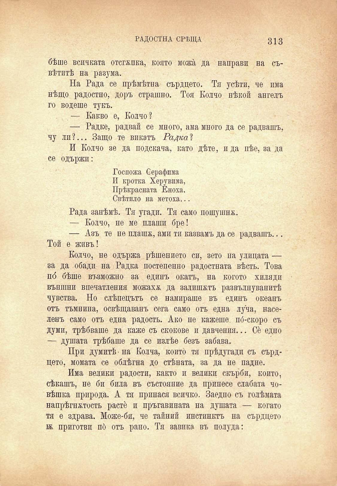

РАДОСТНА СРѢЩА

313

бѣше всичката отстѫпка, която можа да направи на съвѣтитѣ на разума.

На Рада се прѣмѣтна сърдцето. Тя усѣти, че има нѣщо радостно, доръ страшно. Тоя Колчо нѣкой ангелъ го водете тукъ.

— Какво е, Колчо ?

— Радке, радвай се много, ама много да се радвашъ, чу ли?... Защо те викатъ Радка 2

И Колчо зе да подскача, като дѣте, ида пѣе, за да се одържи:

Госпожа Серафима И кротка Херувима, Прѣкрасната Еноха. Свѣтило на метоха...

Рада занѣмѣ. Тя угади. Тя само пошушна.

— Колчо, не ме плаши бре!

— Азъ те не плашж, ами ти казвамъ да се радвашъ... Той е живъ!

Колчо, не одържа рѣшението си, зето па улицата — за да обади на Радка постепенно радостната вѣсть. Това пб бѣше възможно за единъ окатъ, на когото хиляди външни впечатления можаха да залитатъ развълнуванитѣ чувства. Но слѣпецътъ се намираше въ единъ океанъ отъ тъмнина, освѣщаванъ сега само отъ една луѝа, населенъ само отъ една радость. Ако не кажеше, по́-скоро съ думи, трѣбваше да каже съ скокове и давчения... Се едно — душата трѣбаше да се излѣе безъ забава.

При думитѣ * на Колча, който тя прѣдугади съ сърдцето, момата се облѣгна до стѣната, за да не падне.

Има велики радости, както и велики скърби, който, сѣкатъ, не би била въ състояние да принесе слабата човѣшка природа. А тя принася всичко. Заедно съ голѣмата напрѣгнжтость расте и пръгавината на душата — когато тя е здрава. Може-би, че тайний инстинктъ на сърдцето ж приготви пб отъ рано. Тя завика въ полуда:

