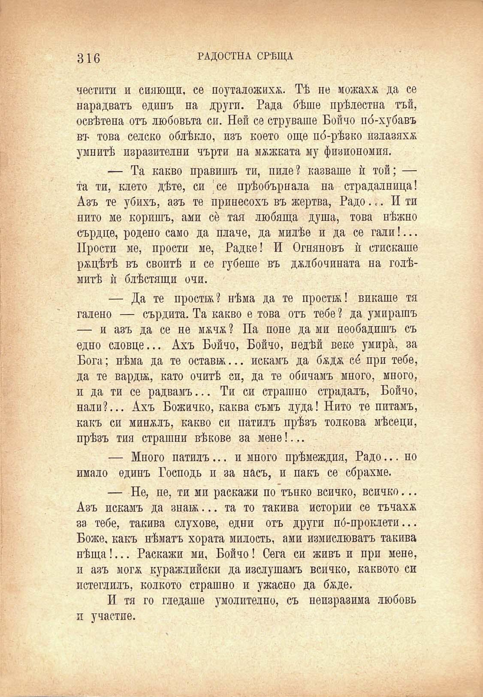

316

РАДОСТНА СРѢЩА

честити и сияющи, се поуталожиха. Тѣ пе можаха да се нарадватъ единъ па други. Рада бѣше прѣлестна тъй, освѣтена отъ любовьта си. Ней се струваше Бойчо по́-хубавъ въ това селско облѣкло, изъ което още по́-рѣзко излавяха умнитѣ изразителни чърти на мѫжката му физиономия.

— Та какво правишъ ти, пиле? казваше ѝ той; — та ти, клето дѣте, си се прѣобърнала на страдалница! Азъ те убихъ, азъ те принесохъ въ жертва, Радо... И ти нито ме коришъ, ами се тая любяща душа, това нѣжно сърдце, родено само да плаче, да милѣе и да се гали!... Прости ме, прости ме, Радке! И Огняновъ ѝ стискаше ръцѣтѣ въ своитѣ и се губете въ дълбочината на голѣмитѣ ѝ блѣстящи очи.

— Да те проствь? нѣма да те простна! викаше тя галено — сърдита. Та какво е това отъ тебе ? да умирашъ — и азъ да се не мъчъ? Па поне да ми необадишъ съ едно словце... Ахъ Бойчо, Бойчо, недѣй веке умира, за Бога; нѣма да те оставж... искамъ да бъдъ ей при тебе, да те вардгъ, като очитѣ си, да те обичамъ много, много, и да ти се радвамъ... Ти си страшно страдалъ, Бойчо, нали?... Ахъ Божичко, каква съмъ луда! Нито те питамъ, какъ си минълъ, какво си патилъ прѣзъ толкова мѣсеци, прѣзъ тия страшни вѣкове за мене!...

— Много патилъ... и много прѣмеждия, Радо... но имало единъ Господь и за на́съ, и пакъ се сбрахме.

— Не, не, ти ми раскажи по тънко всичко, всичко... Азъ искамъ да знакъ... та то такива истории се тънахъ за тебе, такива слухове, едни отъ други по́-проклети... Боже, какъ нѣматъ хората милость, ами измислюватъ такива нѣща!... Раскажи ми, Бойчо! Сега си живъ и при мене, и азъ могъ куражлийски да изслушамъ всичко, каквото си потеглилъ, колкото страшно и ужасно да бъде.

И тя го гледаше умолително, съ неизразима любовь и участие.

