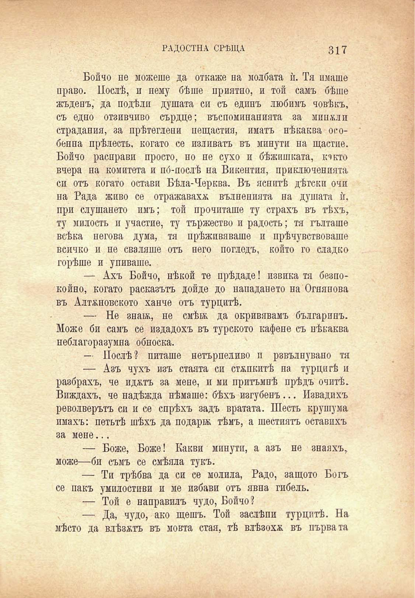

РАДОСТНА СРѢЩА

317

Бойчо не можеше да откаже на молбата ѝ. Тя имаше право. Послѣ, и нему бѣше приятно, и той самъ бѣше жъденъ, да подѣли душата си съ единъ любимъ човѣкъ, съ едно отзивчиво сърдце; въспоминанията за минжли страдания, за прѣтеглени нещастия, иматъ нѣкаква особенна прѣлесть, когато се изливатъ въ минути на щастие. Бойчо расправи просто, но не сухо и бѣжишката, кчкто вчера на комитета и по́-послѣ на Викентия, приключенията си отъ когато остави Бѣла-Черква. Въ яснитѣ дѣтски очи на Рада живо се отражаваха вълненията на душата ѝ. при слушането имъ; той прочиташе ту страхъ въ тѣхъ, ту милость и участие, ту тържество и радость; тя гълташе всѣка негова дума, тя прѣживяваше и прѣчувствоваше всичко и не сваляше отъ него погледъ, който го сладко горѣше и униваше.

— Ахъ Бойчо, нѣкой те прѣдаде! извика тя безпокойно, когато расказътъ дойде до нападането на Огнянова въ Алтжновското ханче отъ турцитѣ.

— Не знаж, не смѣй; да окривявамъ българинъ. Може би самъ се издадохъ въ турското кафене съ нѣкаква неблагоразумна обноска.

— Послѣ? питаше нетърпеливо и рзвълнувано тя — Азъ чухъ изъ стаята си стѫпкитѣ на турцитѣ и разбрахъ, че иджтъ за мене, и ми притъмнѣ прѣдъ очитѣ. Виждахъ, че надѣжда нѣмаше: бѣхъ изгубенъ... Извадихъ револверътъ си и се спрѣхъ задъ вратата. Шесть крушума имахъ: петьтѣ шѣхъ да подарж тѣмъ, а шестиятъ оставихъ за мене...

— Боже, Боже! Какви минути, а азъ не знаяхъ, може—би съмъ се смѣяла тукъ.

— Ти трѣбва да си се молила, Радо, защото Богъ се пакъ умилостиви и ме избави отъ явна гибель.

— Той е направилъ чудо, Бойчо?

— Да, чудо, ако щешъ. Той заслѣпи турцитѣ. На мѣсто да влѣзатъ въ мойта стая, тѣ влѣзохѫ въ църва та

