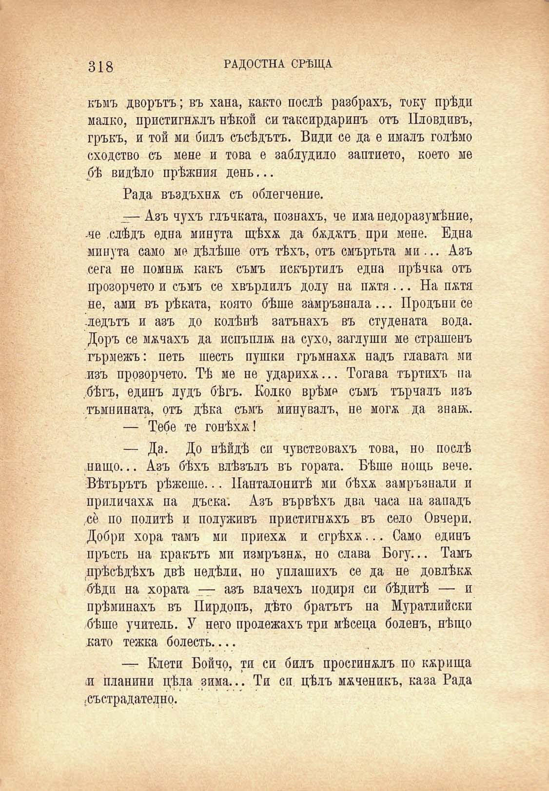

318

РАДОСТНА СРѢЩА

къмъ дворътъ; въ хана, както послѣ разбрахъ, току прѣди малко, пристигналъ нѣкой си таксирдаринъ отъ Пловдивъ, гръкъ, и той ми билъ съсѣдътъ. Види се да е ималъ голѣмо сходство съ мене и това е заблудило заптието, което ме бѣ видѣло прѣжиля день...

Рада въздъхнж съ облегчение.

— Азъ чухъ глъчката, познахъ, че има недоразумѣние, -че .слѣдъ една минута щѣхѫ да бжджтъ. при мене. Една минута само ме дѣлѣше отъ тѣхъ, отъ смъртьта ми... Азъ сега не помнбб какъ съмъ искъртидъ една прѣчка отъ прозорчето и съмъ се хвърлилъ долу на пжтя... На пжтя не, ами въ рѣката, която бѣше замръзвала... Продъни се ледътъ и азъ до колѣнѣ затънахъ въ студената вода. Доръ се мжчахъ да испъплж на сухо, заглуши ме страшенъ гърмежъ: петь шесть пушки гръмнахж надъ главата ми изъ прозорчето. Тѣ ме не ударихж... Тогава търтихъ па ..бѣгъ, единъ лудъ бѣгъ. Колко врѣме съмъ търчалъ изъ тъмнината, отъ дѣка съмъ минувалъ, не могж да званъ.

— Тебе те гонѣхж!

— Да. До нѣйдѣ си чувствовахъ това, но послѣ нищо... Азъ бѣхъ влѣзълъ въ гората. Бѣше нощь вече. Вѣтърътъ рѣжеше... Панталонитѣ ми бѣхѫ замръзвали и приличахж на дъска; Азъ вървѣхъ два часа на западъ ,се по политѣ и полуживъ пристигнжхъ въ село Овчери. Добри хора тамъ ми приехж и сгрѣхж... Само единъ пръсть на кракътъ ми измръзнж, но слава Богу... Тамъ прѣсѣдѣхъ двѣ недѣли, но уплашихъ се да не довлѣкж бѣди на хората — азъ влачехъ подиря си бѣдитѣ — и прѣминахъ въ Пирдопъ, дѣто братътъ на Муратлийски бѣше учитель. У него пролежахъ три мѣсеца боленъ, нѣщо като тежка болесть....

Клети Бойчо, ти си билъ просгинжлъ по кжрища и планини цѣла зима... Ти си цѣлъ мжченикъ, каза Рада -състрадателно.

