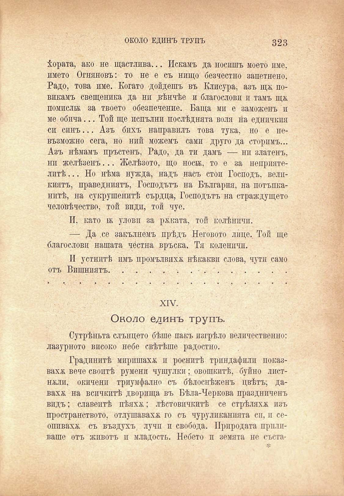

ОКОЛО ЕДИНЪ ТРУПЪ	323

Аората, ако не щастлива... Искамъ да носишъ моето име. името Огняновъ: то не е съ нищо безчестно запетнено, Радо, това име. Когато дойдешъ въ Клисура, азъ щм повикамъ свещеника да ни вѣнчѣе и благослови и тамъ щх. помисли за твоето обезпечение. Баща ми е заможенъ и ме обича... Той ще непълни послѣдната воля на едничкия си синъ... Азъ бихъ направилъ това тука, но е невъзможно сега, но ний можемъ сами друго да сторимъ... Азъ нѣмамъ пръстенъ, Радо, да ти дамъ — ни златенъ, нп желѣзенъ... Желѣзото, що носи, то е за неприятелитѣ... Но нѣма нужда, надъ насъ стои Господъ, велпкиятъ, праведниятъ, Господътъ на България, на потъпканитѣ, на сукрушенитѣ сърдца, Господътъ на страждущето человѣчество, той види, той чуе.

И, като и улови за рѣката, той колѣничи.

— Да .се закълнемъ прѣдъ Неговото лице. Той ще благослови нашата честна връска. Тя коленичи.

И устнитѣ пмъ промълвихѫ нѣкакви слова, чути само отъ Вишниятъ.......................>....................

XIV.

Около е,динъ трупъ.

Сутрѣньта слънцето бѣше пакъ изгрѣло величественно: лазурното високо небе свѣтѣше радостно.

Градинитѣ мирпшахж и роснитѣ трпндафилп показвахж вече своитѣ руменп чушулки; овошкитѣ, буйно листн&ли, окичени триумфално съ бѣлоснѣженъ цвѣтъ, даваха. на всичкитѣ дворища въ Бѣла-Черкова праздниченъ видъ; славеитѣ пѣяхх; лѣстовичкитѣ се стрѣляхж изъ пространството, отлушавахж го съ чуруликанията сп, и сеопивахж съ въздухъ, лучп и свобода. Природата приливаше отъ животъ и младость. Небето и земята не съста

