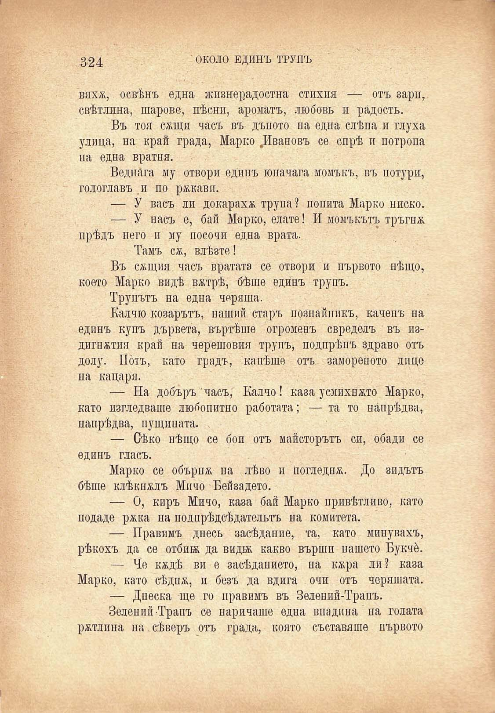

324	ОКОЛО ЕДИНЪ ТРУПЪ

вяхж, освѣнъ една жизнерадостна стихия — отъ зари, свѣтлина, пирове, пѣсни, ароматъ, любовь и радость.

Въ тоя сжщи часъ въ дъното па една слѣпа и глуха улица, на край града, Марко ^Ивановъ се спрѣ и потропа на една вратня.

Веднага му отвори единъ юначага момъкъ, въ потури, гологлавъ .и по ржкавп.

— У васъ ли докараха трупа? попита Марко ниско.

— У насъ е, бай Марко, елате! И момъкътъ тръгнж прѣдъ него и му посочи една врата.

Тамъ сж, влѣзте!

Въ сжщия часъ вратата се отвори и първото нѣщо, което Марко видѣ вжтрѣ, бѣше единъ трупъ.

Трупътъ на една черяша.

Калчю козарътъ, наший старъ познайникъ, каченъ на едпнъ купъ дървета, въртѣше огроменъ свределъ въ издигпжтия край на черешовия трупъ, подпрѣнъ здраво отъ долу. По́тъ, като градъ, капѣше отъ замореното лице на кацаря.

— На добъръ часъ, Калчо! казаусмихнато Марко, като изгледваше любопитно работата; — та то напрѣдва, напрѣдва, пущината.

— Сѣко нѣщо се бои отъ майсторътъ си, обади се единъ гласъ.

Марко се обърнж на лѣво и Погледпж. До зидътъ бѣше клѣкнжлъ Мичо Бейзадето.

— О, киръ Мичо, каза бай Марко привѣтливо. като подаде ржка на подпрѣдсѣдательтъ на комитета.

— Правимъ днесь засѣдание, та, като минувахъ, рѣкохъ да се отбшж да видж какво върши нашето Букче.

— Че кждѣ ви е засѣданието, на кжра ли? каза Марко, като сѣднж, и безъ да вдига очи отъ черяшата.

— Днеска ще го правимъ въ Зелений-Трапъ.

Зелений Трапъ се наричаше една впадина на голата ржтлина на сѣверъ отъ града, която съставяше първото

