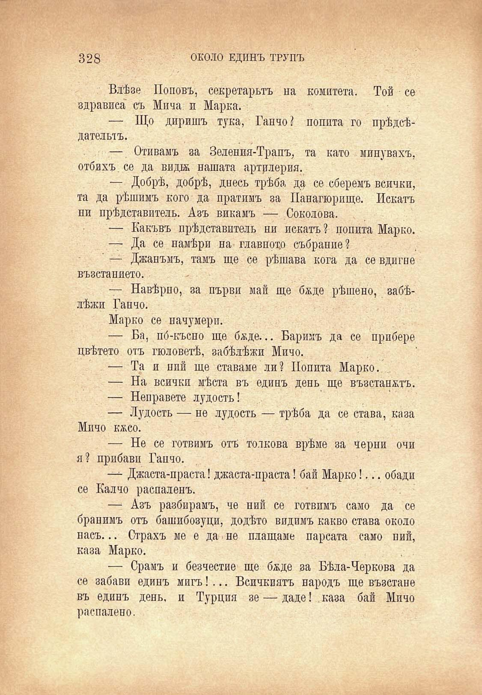

328	ОКОЛО ЕДИНЪ ТРУПЪ

Влѣзе Поповъ, секретарьтъ на комитета. Той се здрависа съ Мича и Марка.

— Що диришъ тука, Ганчо? попита го прѣдсѣдательтъ.

— Отивамъ за Зеления-Трапъ, та като мипувахъ, отбихъ, се да вида нашата артилерия.

— Добрѣ, добрѣ, днесъ трѣба да се сберемъ всички, та да рѣшимъ кого да пратимъ за Панагюрище. Искатъ пи прѣдставитель. Азъ викамъ -— Соколова.

— Какъвъ прѣдставитель ни искатъ ? попита Марко.

— Да се намѣри на главното събрание?

— Джанъмъ, тамъ ще се рѣшава кога да се вдигне възстанието.

— Навѣрно, за първи май ще бѫде рѣшено, забѣлѣжи Ганчо.

Марко се начумери.

— Ба, по́-късно ще бѫде... Варимъ да се прибере цвѣтето отъ гюловетѣ, забѣлѣжи Мичо.

— Та и вий ще ставаме ли? Попита Марко. ..

— На всички мѣста въ единъ день ще възстанжтъ.

— Неправете лудость!

— Лудость — не лудость — трѣба да се става, каза Мичо кжсо.

— Не се готвимъ отъ толкова врѣме за черни очи я? прибави Гапчо.

— Джаста-праста! джаста-праста! бай Марко!... обади се Калчо распаленъ.

—- Азъ разбирамъ, че ний се готвимъ само да се бранимъ отъ башибозуци, додѣто видимъ какво става около насъ... Страхъ ме е да не плащаме парсата само пий, каза Марко.

— Срамъ и безчестие ще бѫде за Бѣла-Черкова да се забави единъ мигъ!... Всичкиятъ народъ ще възстане въ единъ день, и Турция зе — даде! . каза бай Мичо распалено.

