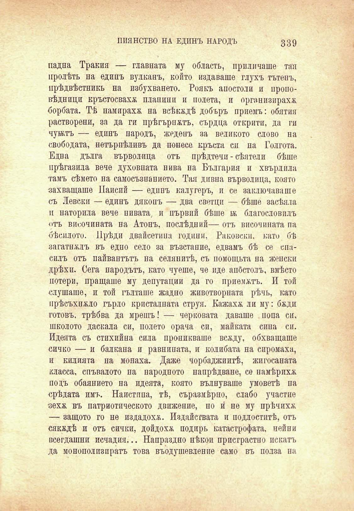

ПИЯНСТВО НА ЕДИНЪ НАРОДЪ

339

падна Тракия — главната му область, приличаше тая пролѣть на единъ вулканъ, който издаваше глухъ тътенъ, прѣдвѣстникъ на избухването. Роякъ апостоли и проповѣдници кръстосваха плапини и подета, и организираха борбата. Тѣ намираха на всѣкѫдѣ добъръ приемъ: обятия растворени, за да ги прѣгърнатъ, сърдца открити, да ги чужтъ — единъ народъ, жеденъ за великото слово на свободата, нетърпѣливъ да понесе кръста си па Голгота. Едва дълга върволица отъ прѣдтечи - сѣя тели бѣше прѣгазила вече духовната нива на България и хвърлила тамъ сѣмето на самосъзнанието. Тая дивна върволица, която захващаше Паисий — единъ калугеръ, и се заключаваше съ Левски — единъ дяконъ — два светци — бѣше засѣяла и наторила вече нивата, и първпй бѣше нь благословилъ отъ височината на Атонъ, послѣдний— отъ височината па бѣсилото. Прѣди двайсетина години, Раковски. като бѣ загатналъ въ едно село за възстание, едвамъ бѣ се спасилъ отъ пайвантътъ на селянитѣ, съ помощьта на женски дрѣхи. Сега народътъ, като чуеше, че иде апостолъ, вмѣсто потери, пращаше му депутации да го приематъ. И той слушаше, и той гълташе жадно животворната рѣчь, като прѣсъхвало гърло кристалната струя. Кажахж ли му: бжди готовъ, трѣбва да мрешъ! — черновата даваше попа си, школото даскала си, полето орача си, майката сина си. Идеята съ стихийна сила проникваше всжду, обхващаше сичко — и балкана и равнината, и колибата на сиромаха, и килията на монаха. Даже чорбаджиитѣ, жигосаната класса, спъвалото па народното напрѣдване, се намѣриха подъ обаянието на идеята, която вълнуваше умоветѣ па срѣдата имъ. Наистина, тѣ, съразмѣрно, слабо участие зеха въ патриотическото движение, но и́ не му прѣчиха — защото го не издадоха. Издайствата и подлоститѣ, отъ сякадѣ и отъ сички, дойдохѫ подиръ катастрофата, нейни всегдашни исчадия... Напраздно нѣкои пристрастно искатъ да монополизиратъ това въодушевление само въ полза на

