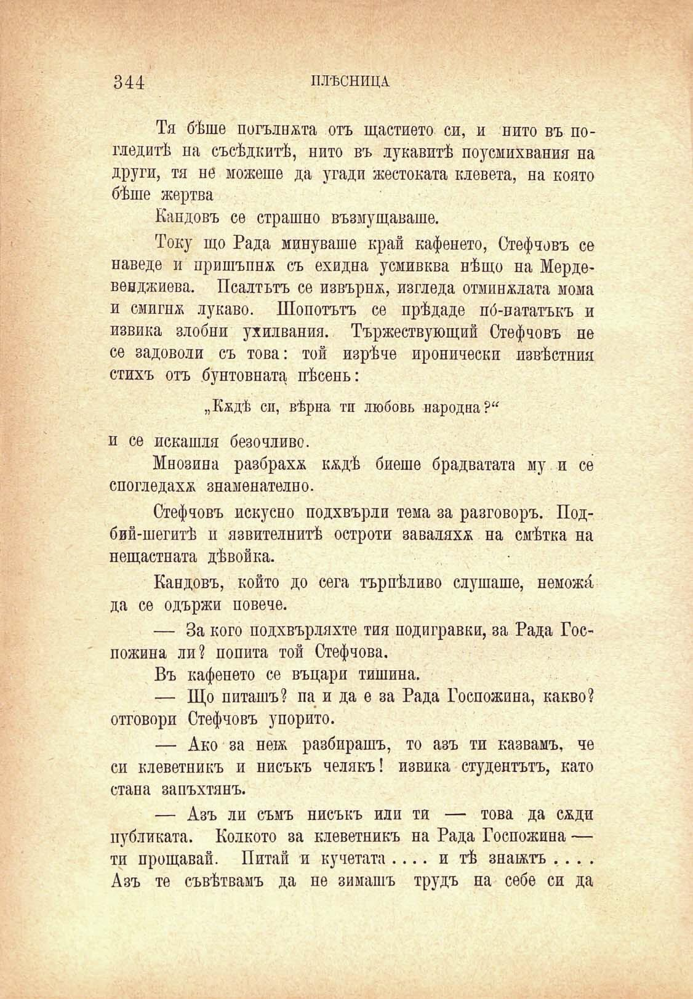

344	плѣсница

Тя бѣше погълната отъ щастието си, и нито въ погледитѣ на съсѣдкитѣ, нито въ лукавитѣ поусмихвания на други, тя не можеше да угади жестоката клевета, на която бѣше жертва

Кандовъ се страшно възмущаваше.

Току що Рада минуваше край кафенето, Стефчовъ се наведе и пришъпнж съ ехидна усмивква нѣщо на Мердевенджиева. Псалтътъ се извървя, изгледа отминжлата мома и смигнж лукаво. Шопотътъ се прѣдаде по́-нататъкъ и извика злобни ухилвания. Тържествующий Стефчовъ не се задоволи съ това: той изрѣче иронически извѣстния стихъ отъ бунтовната пѣсень:

„Кждѣ си, вѣрна ти любовь народна?“ и се искания безочливо.

Мнозина разбрахж кждѣ биеше брадватата му и се спогледахж знаменателно.

Стефчовъ искусно подхвърли тема за разговоръ. Подбий-шегитѣ и язвителнитѣ остроти заваляхж на смѣтка на нещастната дѣвойка.

Кандовъ, който до сега търпѣливо слушаше, неможб, да се одържи повече.

— За кого подхвърляхте тия подигравки, за Рада Госпожица ли? попита той Стефчова.

Въ кафенето се въцари тишина.

— Що питашъ? па и да е за Рада Госпожина, какво? отговори Стефчовъ упорито.

— Ако за неѭ разбирашъ, то азъ ти казвамъ, че си клеветникъ и нисъкъ челякъ! извика студентътъ, като стана запъхтянъ.

— Азъ ли съмъ нисъкъ или ти — това да сжди публиката. Колкото за клеветникъ на Рада Госпожина — ти прощавай. Питай и кучетата .... и тѣ знакътъ . . . . Азъ те съвѣтвамъ да не зимашъ трудъ на себе си да

