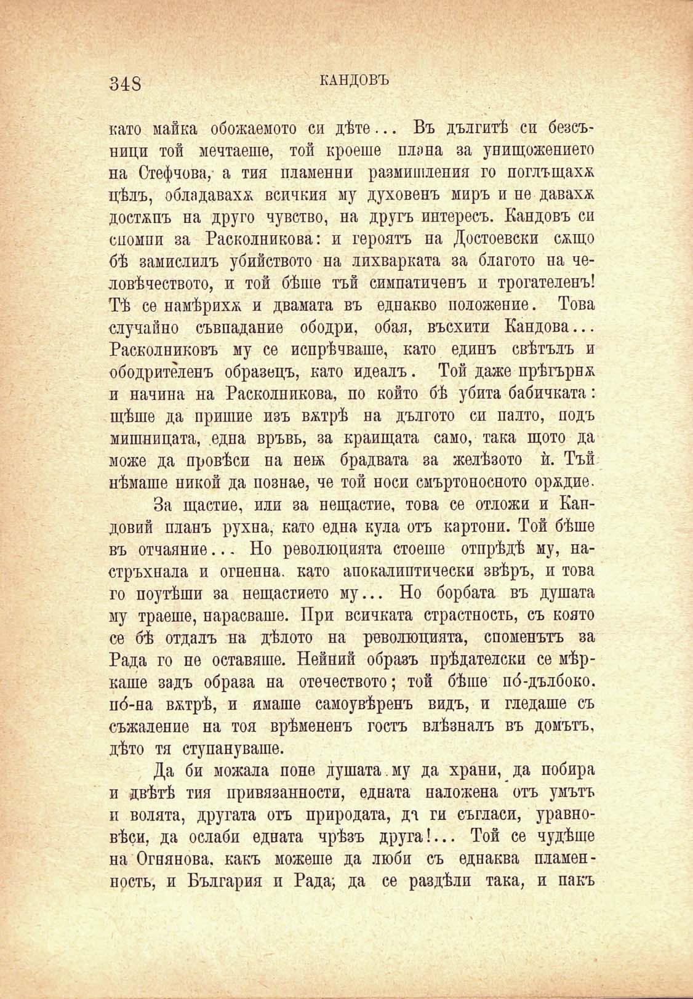

348

КАНДОВЪ

като майка обожаемото си дѣте... Въ дългитѣ си безсъници той мечтаеше, той кроеше плана за унищожението на Стефчова,- а тия пламенни размишления го поглъщаха цѣлъ, обладаваха всичкия му духовенъ миръ и не давахж достѫпъ на друго чувство, на другъ интересъ. Кандовъ си спомни за Расколникова: и героятъ на Достоевски сжтцо бѣ замислилъ убийството на лихварката за благото на челювѣ честното, и той бѣше тъй симпатиченъ и трогателенъ! Тѣ се намѣрихѫ и двамата въ еднакво положение. Това случайно съвпадание ободри, обая, въсхити Кандова... Расколниковъ му се испрѣчваше, като единъ свѣтълъ и ободрителенъ образецъ, като идеалъ. Той даже прѣгърна и начина на Расколникова, по който бѣ убита бабичката: щѣше да пришие изъ вжтрѣ на дългото си палто, подъ мишницата, една връвь, за краищата само, така щото да може да провѣси на пекъ брадвата за желѣзото ѝ. Тъй нѣмаше никой да познае, че той носи смъртоносното орждие.

За щастие, или за нещастие, това се отложи и Капдовий планъ рухна, като една кула отъ картони. Той бѣше въ отчаяние... Но революцията стоеше отпрѣдѣ му, настръхвала и огненна. като апокалиптически звѣръ, и това го поутѣши за нещастието му... Но борбата въ душата му траеше, нарасваше. При всичката страстность, съ която се бѣ отдалъ на дѣлото на революцията, споменътъ за Рада го не оставяше. Нейний образъ прѣдателски се мѣркаше задъ образа на отечеството; той бѣше по́-дълбоко. пб-на вжтрѣ, и имаше самоувѣренъ видъ, и гледаше съ съжаление на тоя врѣмененъ гостъ влѣзналъ въ домътъ, дѣто тя ступануваше.

Да би можала поне душата , му да храни, да побира и двѣтѣ тия привязанности, едната наложена отъ умътъ п волята, другата отъ природата, дт ги съгласи, уравновѣси, да ослаби едната чрѣзъ друга!... Той се чудѣше на Огнянова, какъ можеше да люби съ еднаква пламенность, и България и Рада; да се раздѣли така, и пакъ

