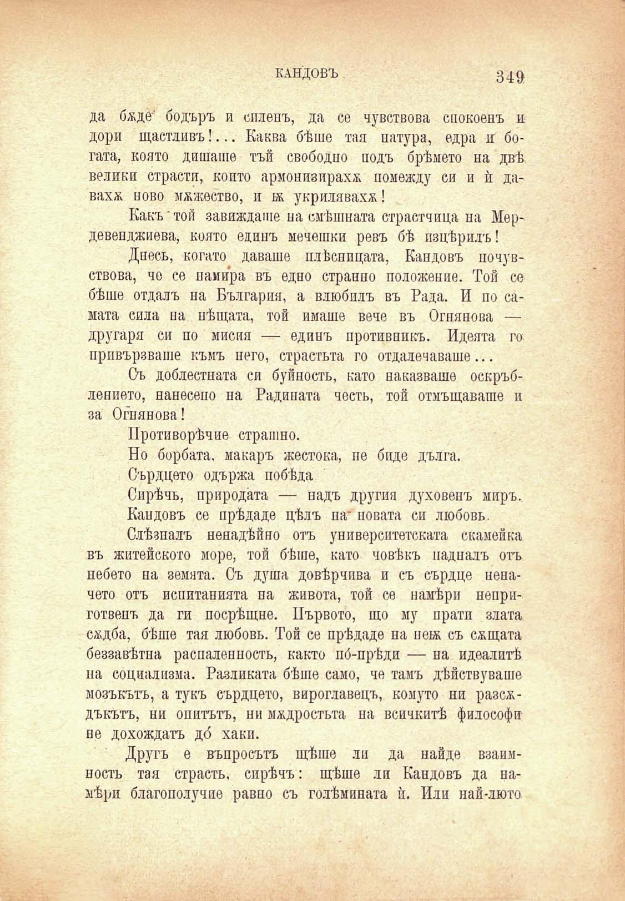

КАНДОВЪ

349

да бѫде' бодъръ и силенъ, да се чувствова спокоенъ и дори щастливъ!... Каква бѣше тая натура, едра и богата, която дишаше тъй свободно подъ брѣмето на двѣ велики страсти, който армонизирахж помежду си и ѝ давахж ново мѫжество, и въ укрилявахж!

Какъ ’ той завиждаше на смѣшната страстчица на Мердевенджиева, която единъ мечешки ревъ бѣ изцѣрилъ!

Днесъ, когато даваше плѣсницата, Кандовъ почувствова, че се намира въ едно странно положение. Той се бѣше отдалъ на България, а влюбилъ въ Рада. И по самата сила на нѣщата, той имаше вече въ Огнянова — другаря си по мисия — единъ противникъ. Идеята го привързваше къмъ него, страстьта го отдалечаваше...

Съ доблестната си буйность, като наказваше оскръблението, нанесепо па Гадината честь, той отмъщаваше и за Огнянова!

Противорѣчие страшно.

Но борбата, макаръ жестока, пе бпде дълга.

Сърдцето одържа побѣда

Сирѣчь, природата — надъ другия духовенъ миръ. Кандовъ се прѣдаде цѣлъ па' новата си любовь.

Слѣзпалъ ненадѣйно отъ университетската скамейка въ житейското море, той бѣше, като човѣкъ падналъ отъ небето на земята. Съ душа довѣрчива и съ сърдце неначето отъ попитанията на живота, той се намѣри неприготвепъ да ги посрѣщне. Иървото, що му пратп злата сждба, бѣше тая любовь. Той се прѣдаде на неѭ съ сжщата беззавѣтна распалепность, както по́-прѣди — на идеалитѣ па социализма. Разликата бѣше само, че тамъ дѣйствуваше мозъкътъ, а тукъ сърдцето, вироглавецъ, комуто ни разсждъкътъ, ни опитътъ, ни мѫдростьта на всичкитѣ философи не дохождатъ до́ хаки.

Другъ е въпросътъ щѣше ли да найде взаимность тая страсть, сирѣчъ: щѣше ли Кандовъ да намѣри благополучие равно съ голѣмината ѝ. Или най-люто

