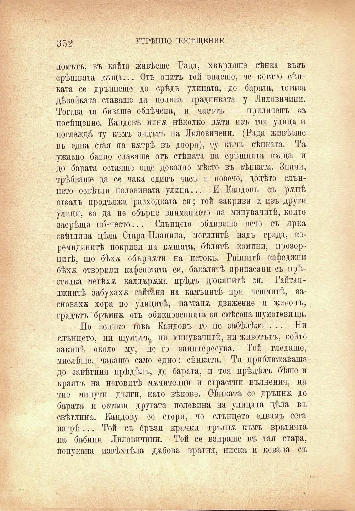

352

УТРѢННО ПОСѢЩЕНИЕ

домътъ, въ който живѣеше Рада, хвърляше сѣнка възъ срѣщната кжща... Отъ опитъ той знаеше, че когато сѣнката се дръпнеше до срѣдъ улицата, до барата, тогава дѣвойката ставаше да полива градинката у Лпловичини. Тогава тя биваше облѣчена, и часътъ — приличенъ за посѣщение. Кандовъ минж. нѣколко пжти изъ тая улица и поглежда ту къмъ зидътъ на Лиловичени. (Рада живѣеше въ една стая па вжтрѣ въ двора), ту къмъ сѣнката. Та ужасно бавно слазяше отъ стѣната на срѣщната кжща, п до барата остаяше още доволно мѣсто въ сѣнката. Значи, трѣбваше да се чака единъ часъ и повече, додѣто слънцето освѣтли половината улица... И Кандовъ съ ржцѣ отзадъ продължи расходката си; той закриви и изъ други улици, за да не обърне вниманието на минувачитѣ, който засрѣща по́-често... Слънцето обливаше вече съ ярка свѣтлина цѣла Стара-Планина, могилитѣ надъ града, коремидинитѣ покриви на кжщята, бѣлитѣ комини, прозорцитѣ, що бѣхѫ обърнжти на истокъ. Раннитѣ кафеджии бѣхѫ отворили кафенетата си, бакалитѣ принасяни съ прѣстилка мет^хж калджржма прѣдъ дюкянитѣ си. Гайтапджиитѣ забухахж гайтани на камънитѣ при чешмитѣ, засновахж хора по улицитѣ, настанж движение и животъ, градътъ бръмнж отъ обикновепната си смѣсена шумотевица.

Но всичко това Кандовъ го не забѣлѣжи ... Ни слънцето, ни шумътъ,, ни минувачитѣ, ни животътъ, който закипѣ около му, не го заинтересува. Той гледаше, мислѣше, чакаше само едно: сѣнката. Тя приближаваше до завѣтния прѣдѣлъ, до барата, и тоя прѣдѣлъ бѣше и краятъ на неговитѣ мжчителни и страстни вълнения, на тие минути дълги, като вѣкове. Сѣнката се дръпнж до барата и остави другата половина на улицата цѣла въ свѣтлина. Кандову се стори, че слънцето едвамъ сега изгрѣ... Той съ бръзи крачки тръгнж къмъ вратнята на бабини Лпловичини. Той се взираше въ тая стара, попукана извѣхтѣла джбова вратня, ниска и кована съ

