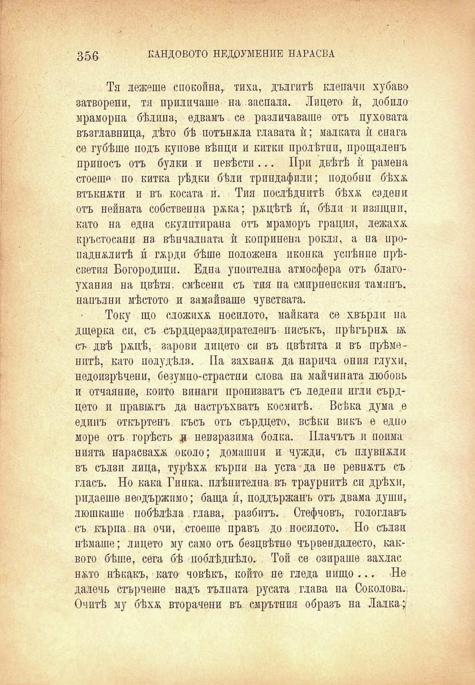

356

КАНДОВОТО НЕДОУМЕНИЕ НАРАСНА

Тя лежеше спокойна, тиха, дългитѣ клепачи хубаво затворени, тя приличаше на заепала. Лицето ѝ, добпло мраморна бѣлина, едвамъ. се различаваше отъ пуховата възглавница, дѣто бѣ потъвала главата ѝ; малката ѝ снага се губѣше подъ купове вѣпци и китки пролѣтни, прощаленъ приносъ отъ булки и невѣсти... При двѣтѣ ѝ рамена стоеше по китка рѣдки бѣли трипдафили; подобни бѣхж втъкнжти и въ косата и́. Тия послѣднитѣ бѣхѫ садени отъ нейната собственна ржка; ржцѣтѣ и́, бѣли и изящни, като на едпа скулптирана отъ мраморъ грация, лежаха кръстосани на вѣпчалната ѝ копринена рокля, а на иропаднжлитѣ и́ гжрди бѣше положена иконка успѣние прѣсветия Богородици. Една упоителна атмосфера отъ благоухания на цвѣтя, смѣсени съ тия па смприенския тамянъ, напълни мѣстото и замайваше чувствата.

Току що сложихж носилото, майката се хвърли па дщерка си, съ сърцераздирателенъ писъкъ, прѣгърнж ж съ двѣ ржцѣ, зарови лицето си въ цвѣтята и въ прѣмонптѣ, като полудѣла. Па захвапж да нарича ония глухи, недоизрѣчени, безумпо-страстпи слова па майчината любовь и отчаяние, който винаги пронизватъ съ ледени игли сърдцето и правжгъ да настръхватъ космитѣ. Всѣка дума е единъ откъртенъ късъ отъ сърдцето, всѣки викъ е едно море отъ горѣсть я неизразима болка. Плачътъ и поима нията нарасвахж около; домашни и чужди, съ плувнжли въ сълзи лица, турѣхѫ кърпи на уста да пе ревнжтъ съ гласъ. Но кака Гинка, плѣнителна въ траурнитѣ си дрѣхп, ридаеше неодържимо; баща и́, поддържанъ отъ двама души, люшкаше побѣлѣла. глава, разбитъ. Стефчовъ, гологлавъ съ кърпа, на очи, стоеше правъ до носилото. Но сълзи нѣмаше; лицето му само отъ безцвѣтно чървендалесто, каквото бѣше, сега бѣ поблѣднѣло. Той се опираше захлас нжто нѣкакъ, като човѣкъ, който пе гледа нищо ... Не далечъ стърчеше надъ тълпата русата глава па Соколова. Очитѣ му бѣхѫ вторачени въ смрътния образъ на Лалка;

