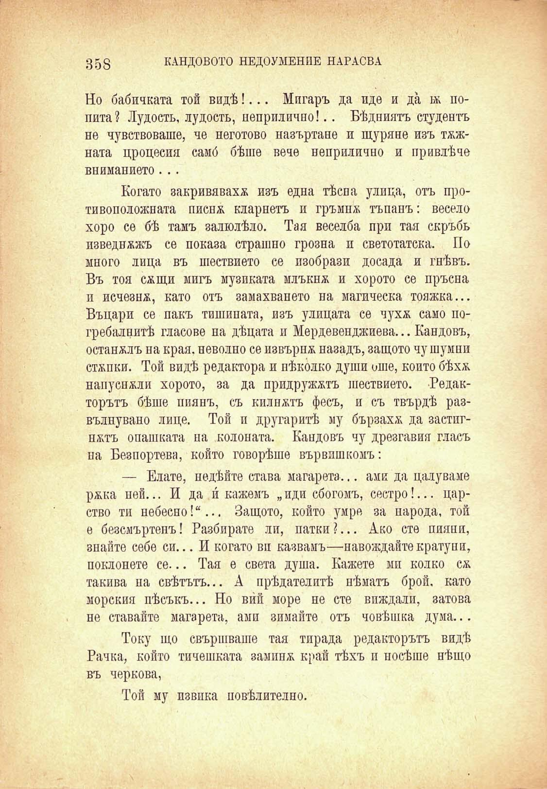

358

КАНДОВОТО НЕДОУМЕНИЕ НАРАСВА

Но бабичката той видѣ!... Мигаръ да иде и да ж попита ? Лудость, лудость, неприлично!.. Бѣдниятъ студентъ не чувствоваше, че неготово назъртане и щуране изъ тѫжната цроцесия самб бѣше вече неприлично и привлѣче вниманието. ..

Когато закривяваха изъ една тѣсна улица, отъ противоположната писпж кларнетъ и гръмпж тъпанъ: весело хоро се бѣ тамъ залюлѣло. Тая веселба при тая скръбь изведнжжъ се показа страшно грозна и светотатска. По много лица въ шествието се изобрази досада и гнѣвъ. Въ тоя сжщи мигъ музиката млъкнж и хорото се пръсна и исчезнж, като отъ замахването на магическа тояжка... Въцари се пакъ тишината, изъ улицата се чухж само погребалнитѣ гласове на дѣцата и Мердевенджиева... Кандовъ, останалъ на края, неволно се извърпж назадъ, защото чу шумни стжпки. Той видѣ редактора и нѣколко души оше, който бѣхж напуснжли хорото, за да придружжтъ шествието. Редакторътъ бѣше пиянъ, съ килнжтъ фесъ, и съ твърдѣ развълнувано лице. Той и другаритѣ му бързахж да застпгнжтъ опашката на колоната. Кандовъ чу дрезгавия гласъ на Безпортева, който говорѣше вървпшкомъ:

— Елате, недѣйте става магарета... ами да цалуваме ржка ней... И да и́ кажемъ „иди сбогомъ, сестро!... царство ти небесно!“... Защото, който умре за народа, той е безсмъртенъ! Разбирате ли, патки ?... Ако сте пияни, знайте себе си... И когато ви казвамъ—навождайте кратуни, поклонете се... Тая е света душа. Кажете мп колко сж такива на свѣтътъ... А прѣдателитѣ нѣматъ брой, като морския пѣсъкъ... Но ви́й море не сте впждалп, затова не ставайте магарета, ами зимайте отъ човѣшка дума...

Току що свършваше тая тирада редакторътъ видѣ Рачка, който тичешката заминж край тѣхъ и носѣше нѣщо въ чернова,

Той му извика повѣлително.

