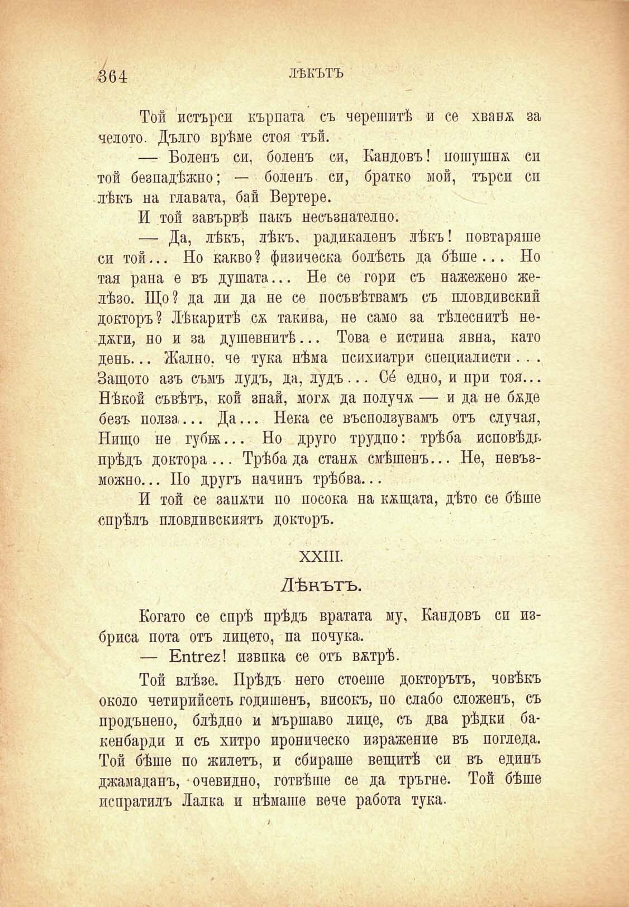

4б4

ЛѢКЪТЪ

Той истърси кърпата съ черешитѣ и се хванж за челото. Дълго врѣме стоя тъй.

— Боленъ си, боленъ си, Кандовъ! пошушна си той безпадѣжно; — боленъ си, братко мой, търси сп лѣкъ на главата, бай Вертере.

И той завървѣ пакъ несъзнателно.

— Да, лѣкъ, лѣкъ, радикаленъ лѣкъ! повтаряше си той... Но какво? физическа болѣсть да бѣше... Но тая рана е въ душата... Не се гори съ нажежено желѣзо. Що? да ли да не се посъвѣтвамъ съ пловдивский докторъ? Лѣкаритѣ сѫ такива, пе само за тѣлеснитѣ неджги, по и за душевнитѣ... Това е истина явна, като день... Жално, че тука нѣма психиатри специалисти . . . Защото азъ съмъ лудъ, да, лудъ... Со́ едно, и при тоя... Нѣкой съвѣтъ, кой знай, могж да получж — и да не бѫде безъ полза... Да... Нека се въсползувамъ отъ случая, Нищо не губж... Но друго трудпо: трѣба исповѣдь прѣдъ доктора... Трѣбада станж смѣшенъ... Не, невъзможно... Но другъ начинъ трѣбва...

И той се занжти но посока на кжщата, дѣто се бѣше спрѣлъ пловдивскиятъ докторъ.

XXIII.

Лѣкътъ.

Когато се спрѣ прѣдъ вратата му, Кандовъ си избриса пота отъ лицето, па почука.

— ЕпГгег! извпка се отъ вжтрѣ.

Той влѣзе. Прѣдъ него стоеше докторътъ, човѣкъ около четирийсеть годишенъ, високъ, но слабо сложенъ, съ продънено, блѣдно и мършаво лице, съ два рѣдки бакенбарди и съ хитро ироническо изражение въ погледа. Той бѣше по Жилетъ, и сбираше вещитѣ си въ единъ джамаданъ, очевидно, готвѣше се да тръгне. Той бѣше лспратилъ Лалка и нѣмаше вече работа тука.

