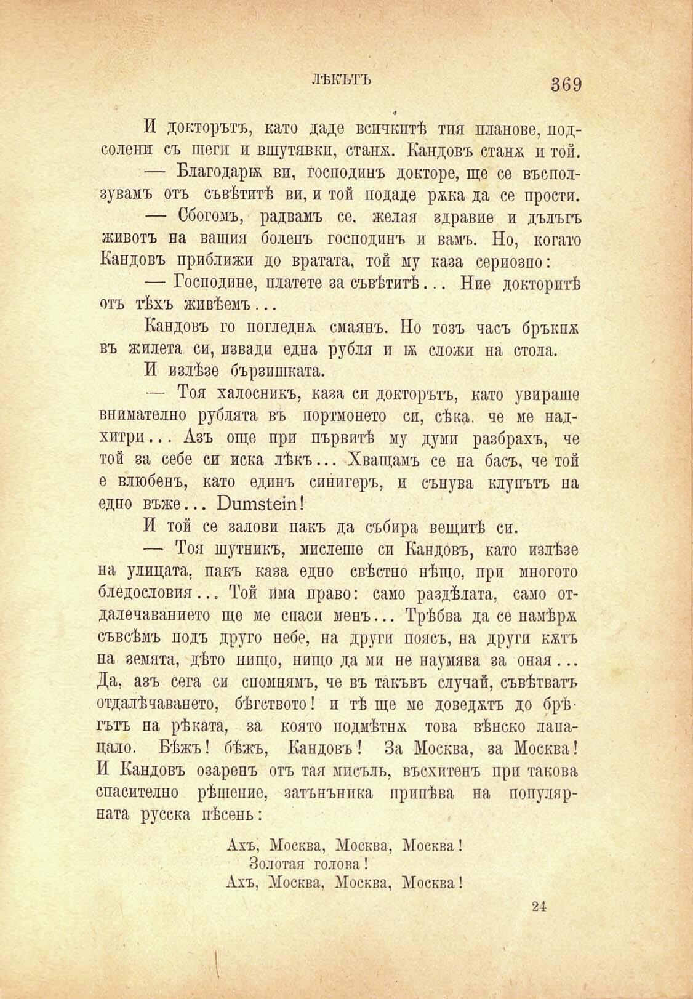

ЛѢКЪТЪ

369

И докторътъ, като даде всичкитѣ тия планове, подсолени съ шеги и вшутявкп, стапя. Кандовъ станм и той.

— Благодари ви, господинъ докторе, ще се въсползувамъ отъ съвѣтитѣ ви, и той подаде рмка да се прости.

— Сбогомъ, радвамъ се. желая здравие и дълъгъ животъ на вашия боленъ господинъ и вамъ. Но, когато Кандовъ приближи до вратата, той му каза сериозно:

— Господине, платете за съвѣтитѣ... Ние докторитѣ отъ тѣхъ живѣемъ...

Кандовъ го погледна смаянъ. Но тозъ часъ бръкнж въ Жилета си, извади една рубли и и сложи на стола.

И излѣзе бързпшката.

— Тоя халосникъ, каза си докторътъ, като увираше внимателно рублата въ портмонето си, сѣка, че ме надхитри... Азъ още при първитѣ му думи разбрахъ, че той за себе си иска лѣкъ... Хващамъ се на басъ, че той е влюбенъ, като единъ синигеръ, и сънува клупътъ па едно въже... Вшпз^еш!

И той се залови пакъ да събира вещитѣ си.

— Тоя шутникъ, мислете си Кандовъ, като излѣзе на улицата, пакъ каза едно свѣстно нѣщо, при многото бледословия... Той има право: само раздѣлата, само отдалечавапието ще ме спаси менъ... Трѣбва да се намѣря съвсѣмъ подъ друго небе, на други поясъ, на други кятъ на земята, дѣто нищо, нищо да ми не наумява за оная... Да, азъ сега си спомнямъ, че въ такъвъ случай, съвѣтватъ отдалѣчаването, бѣгството! и тѣ ще ме доведятъ до брѣгътъ на рѣката, за която подмѣтня това вѣнско лапацало. Бѣжъ! бѣжъ, Кандовъ! За Москва, за Москва! И Кандовъ озаренъ отъ тая мисъль, въсхптенъ при такова спасително рѣшение, затънънпка припѣва на популярната русска пѣсень:

Ахъ, Москва, Москва, Москва!

Золотая голова!

Ахъ, Москва, Москва, Москва!

21

