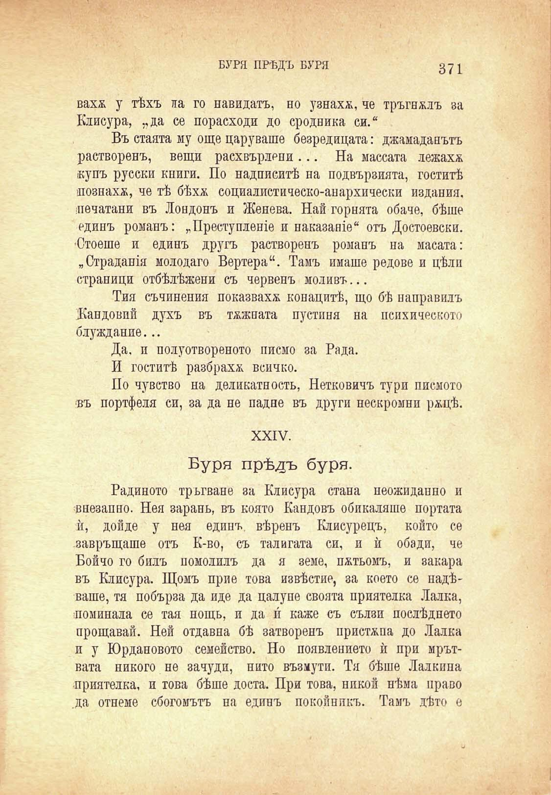

мре-

вахж у тѣхъ ла Клисупа. ..да се

БУРЯ ПРѢДЪ БУРЯ	з71

го навидатъ, но узнаха, че тръгналъ за порасходи до сродника си.“

Въ стаята му още царуваше безредицата: джамаданътъ

растворенъ, вещи расхвърлени... На массата лежахж купъ русски книги. По надписитѣ на подвързията, гоститѣ нознахж, че тѣ бѣхѫ социалистическо-анархически издания, печатани въ Лондонъ и Женева. Най горната обаче, бѣше единъ романъ: „Преступленхе и наказание“ отъ Достоевски. ■Стоеше и единъ другъ растворенъ романъ на масата: „Страдания молодаго Вертера“. Тамъ имаше редове и цѣли страници отбѣлѣжени съ червенъ моливъ...

Тия съчинения показваха конацитѣ, що бѣ направилъ Жандовий духъ въ тжжната пустиня на психическото блуждание...

Да. и полуотвореното писмо за Рада.

И гоститѣ разбраха всичко.

По чувство на деликатность, Нетковичъ тури писмото въ портфеля си, за да не падне въ други нескромни ржцѣ.

XXIV.

Буря прѣдъ буря.

Радиното тръгване за Клисура стана неожидапно и внезапно. Нея зарань, въ която Кандовъ обикаляше портата ѝ, дойде у нея единъ, вѣренъ Клисурецъ, който се завръщаше отъ К-во, съ талигата си, и ѝ обади, че Бойчо го билъ помолилъ да я земе, пжтьомъ, и закара въ Клисура. Щомъ прие това извѣстие, за което се надѣваше, тя побърза да иде да цалупе своята приятелка Лалка, поминаха се тая нощь, и да и каже съ сълзи послѣднето прощавай. Ней отдавна бѣ затворенъ пристѫпа до Лалка и у Юрдановото семейство. Но появлението ѝ при мрътвата никого не зачуди, нито възмути. Тя бѣше Лалкипа приятелка, и това бѣше доста. При това, нпкой нѣма право .да отнеме сбогомътъ на единъ покойникъ. Тамъ дѣто е

