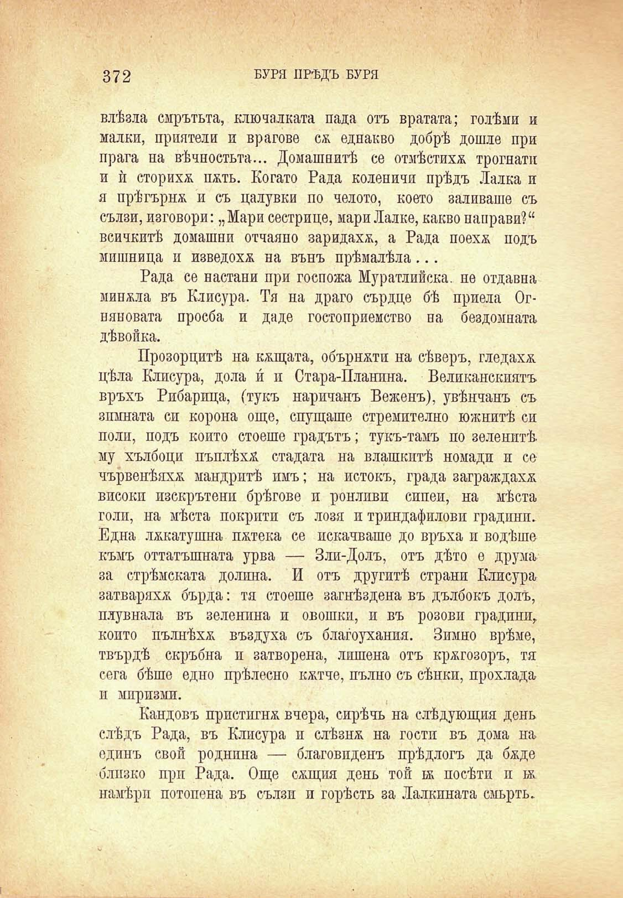



БУРЯ ПРѢДЪ БУРЯ

.<-чЛЛЖ’кЧ^1 . »Л<	’ : ПГ.'1 > ■. ' ‘

372

влѣзла смрътьта, ключалката пада отъ вратата; голѣми и малки, приятели и врагове сѫ еднакво добрѣ дошле при прага на вѣчностьта... Домашнитѣ се отмѣстихѫ трогнатп и ѝ сторихж пжть. Когато Рада коленичи прѣдъ Лалка и я прѣгърна и съ цалувки по челото, което заливаше съ сълзи, изговори: „Мари сестрице, мари Лалке, какво направи?“ всичкитѣ домашни отчаяно заридаха, а Рада поехж подъ мишница и изведохѫ на вънъ прѣмалѣла...

Рада се настани при госпожа Муратлийска. не отдавна минжла въ Клисура. Тя на драго сърдце бѣ приела Огняновата просба и даде гостоприемство па бездомната дѣвойка.

Прозорцитѣ на кѫщата, обърнжти на сѣверъ, гледахж цѣла Клисура, дола и́ н Стара-Планпна. Великанскиятъ връхъ Рпбарица, (тукъ наричанъ Веженъ), увѣнчанъ съ зимната си корона още, спущаше стремително южнитѣ си поли, подъ който стоеше градътъ; тукъ-тамъ по зеленитѣ му хълбоци пъплѣха стадата на влашкитѣ номади и се чървенѣяхж. мандритѣ пмъ; на потокъ, града заграждаха високп пзскрътени брѣгове и ронливи сипеи, на мѣста голи, на мѣста покрити съ лози и триндафилови градини. Една лѫкатушна пжтека се покачваше до връха н водѣше къмъ оттатъшната урва — Зли-Долъ, отъ дѣто е друма за стрѣмската долина. И отъ другитѣ страни Клисура затваряха бърда: тя стоеше загнѣздена въ дълбокъ долъ, плувнала въ зеленина и овошки, и въ розови градини, копто пълнѣха въздуха съ благоухания. Зимно врѣме, твърдѣ скръбна и затворена, лишена отъ крѫгозоръ, тя сега бѣше едно прѣлесно кжтче, пълно съ сѣнкп, прохлада и миризми.

Кандовъ пристигна вчера, сирѣчь на слѣдующия день слѣдъ Рада, въ Клисура и слѣзнж на гости въ дома на единъ свой роднина — благовиденъ прѣдлогъ да бѫде близко при Рада. Още сжщия день той к посѣти и гж намѣри потопена въ сълзи и горѣсть за Лалкината смърть.

