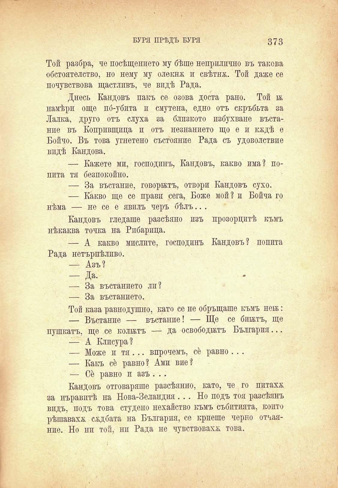

БУРЯ ПРѢДЪ БУРЯ

373

Той разбра, че посѣщенпето му бѣше неприлично въ такова обстоятелство, но нему му олекна и свѣтна. Той даже се почувствова щастливъ, че видѣ Рада.

Днесъ Кандовъ пакъ се озова доста рано. Той к намѣрп още по́-убпта и смутена, едно отъ скръбьта за Лалка, друго отъ слуха за близкото избухване въстание въ Копривщица и отъ незнанието що е и кждѣ е Бойчо. Въ това угнетено състояние Рада съ удоволствие впдѣ Кандова.

— Кажете ми, господинъ, Кандовъ, какво има? поппта тя безпокойно.

— За въстание, говорятъ, отвори Кандовъ сухо.

— Какво ще се прави сега, Боже мой? и Бойча го нѣма — не се е явилъ черъ бѣлъ.. .

Кандовъ гледаше разсѣяно изъ прозорцитѣ къмъ нѣкаква точка на Рпбарпца.

— А какво мислите, господинъ Кандовъ? попита Рада нетърпѣлпво.

— Азъ?

— Да-

— За въстанието лп?

— За въстанието.

Той каза равнодушно, като се не обръщаше къмъ нея:

— Въстание — въстание! — Ще се бикътъ, ще пушкатъ, ще се колитъ — да освободятъ България...

— А Клисура?

— Може и тя. .. впрочемъ, се равно . . .

— Какъ сб равно? Ами вие?

— Се равно и азъ . . .

Кандовъ отговаряше разсѣянно, като, че го питахж за нъравитѣ на Нова-Зеландия ... Но подъ тоя разсѣянъ впдъ, подъ това студено нехайство къмъ събптията, който рѣшавахж сждбата на България, се криеше черно отчаянпе. Но ни той, ни Рада не чувствовахл; това.

