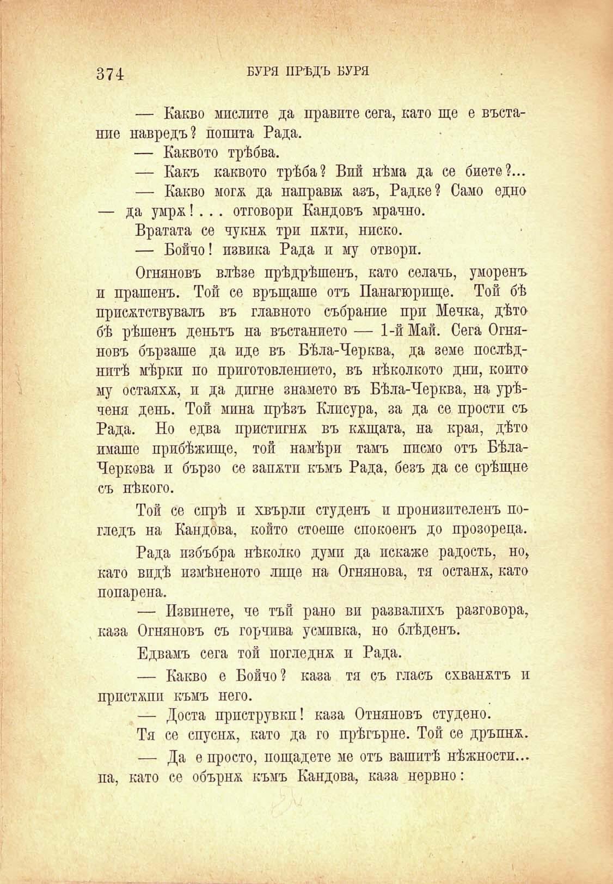

374

БУРЯ ПРѢДЪ БУРЯ

— Какво мислите да правите сега, като ще е въстание навредъ? попита Рада.

— Каквото трѣбва.

— Какъ каквото трѣба? Вий нѣма да се биете?...

— Какво могж да направа азъ, Радке? Само едно — да умрж! . .. отговори Кандовъ мрачно.

Вратата се чукнж три пжти, ниско.

— Бойчо! извика Рада и му отвори.

Огняновъ влѣзе прѣдрѣшенъ, като селачь, уморенъ и прашенъ. Той се връщаше отъ Панагюрище. Той бѣ присжтствувалъ въ главното събрание при Мечка, дѣто бѣ рѣшенъ деньтъ на въстанието — 1-й Май. Сега Огняновъ бързаше да иде въ Бѣла-Черква, да земе послѣднитѣ мѣрки по приготовлението, въ нѣколкото дни, който му остаяхж, и да дигне знамето въ Бѣла-Черква, на урѣченя день. Той мина прѣзъ Клисура, за да се прости съ Рада. Но едва пристигна въ кжщата, на края, дѣто имаше прибѣжище, той намѣри тамъ писмо отъ БѣлаЧеркова и бързо се запжтп къмъ Рада, безъ да се срѣщне съ нѣкого.

Той се спрѣ и хвърли студенъ и пронизителенъ погледъ на Кандова, който стоеше спокоенъ до прозореца.

Рада пзбъбра нѣколко думи да покаже радость, но> като впдѣ измѣненото лице на Огнянова, тя остана, като попарена.

— Извинете, че тъй рано ви развалихъ разговора, каза Огняновъ съ горчива усмивка, но блѣденъ.

Едвамъ сега той погледна и Рада.

— Какво е Бойчо? каза тя съ гласъ схванатъ н пристжпи къмъ него.

— Доста приструвкп! каза Отняновъ студено.

Тя се спуснж, като да го прѣгърне. Той се дръпнж.

— Да е просто, пощадете ме отъ вашитѣ нѣжностп... па, като се обърнж къмъ Кандова, каза нервно:

