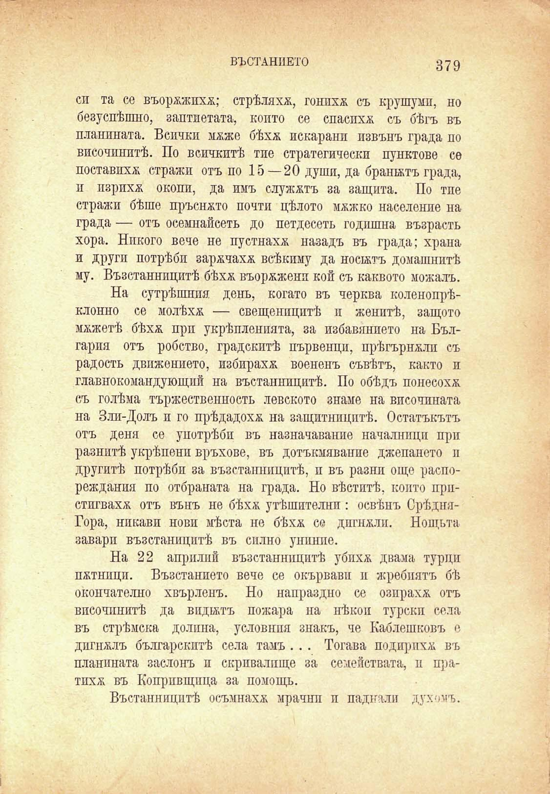

ВЪСТАНИЕТО

379

си та се въоржжпхж; стрѣляхж, гонихж съ крушуми, но безуспѣшно, заптиетата, копто се спасихж съ бѣгъ въ планината. Всички мжже бѣхѫ некарани извънъ града по височинитѣ. По всичкитѣ тие стратегически пунктове се поставихѫ стражи отъ по 15 — 20 души, да бранятъ града, и изрихж окопи, да имъ служжтъ за защита. По тие стражи бѣше пръснато почти цѣлото мжжко население на града — отъ осемнайсеть до петдесеть годишна възрасть хора. Никого вече не пустнахж назадъ въ града; храна и други потрѣби заржчахж всѣкиму да носътъ домашнитѣ му. Възстанницитѣ бѣхѫ въоржженп кой съ каквото можалъ.

На сутрѣшнпя день, когато въ черква коленопрѣклонно се молѣхѫ — свещеницитѣ и женитѣ, защото мжжетѣ бѣхѫ при укрѣпленията, за избавянпето на България отъ робство, градскитѣ първенци, прѣгърнжлп съ радость движението, избирахж воененъ съвѣтъ, както и главнокомандующий на въстанницитѣ. По обѣдъ понесохж съ голѣма тържественность левското знаме на височината на Зли-Долъ и го прѣдадохж на защитницитѣ. Остатъкътъ отъ деня се употрѣби въ назначавание началници при разнитѣ укрѣпени връхове, въ дотъкмявание джепането п другитѣ потрѣби за възстанницитѣ, и въ разни още разреждания по отбраната на града. Но вѣститѣ, който пристигвахж отъ вънъ не бѣхѫ утѣшителни: освѣнъ СрѣдняГора, никавн нови мѣста не бѣхѫ се дпгнжли. Нощьта завари възстаницитѣ въ силно униние.

На 22 априлий възстанницитѣ убпхж двама турци пжтници. Възстанието вече се окървави и жребиятъ бѣ окончателно хвърленъ. Но напраздно се озпрахж отъ височинитѣ да видътъ пожара на нѣкои турски села въ стрѣмска долина, условния знакъ, че Каблешковъ е дигнжлъ българскитѣ села тамъ . . . Тогава подирпхж въ планината заслонъ и скривалище за семействата, и пратпхж въ Копривщица за помощь.

Въстанницитѣ осъмнахж мрачнп и паднали духамъ.

