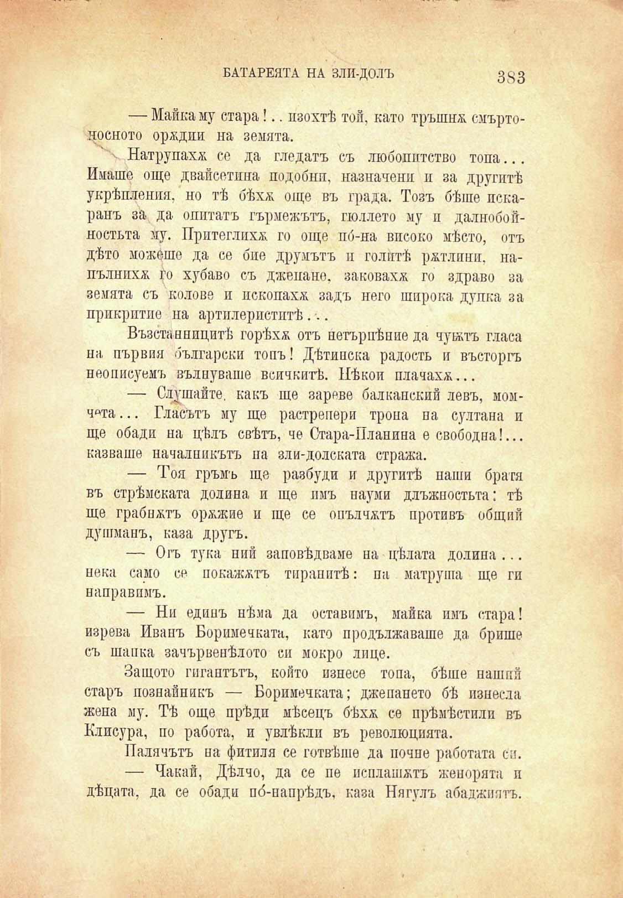

БАТАРЕЯТА НА ЗЛИ-ДОЛЪ	3^3

— Майка му стара!.. пзохтѣ той, като тръшнж смъртоносното орждии на земята.

к Натрупахж се да гледатъ съ любопитство топа... Имаше още двайсетина подобни, назначени и за другитѣ укрѣпления, но тѣ бѣхѫ още въ града. Тозъ бѣше некаранъ за да опитатъ гърмежътъ, подлото му и далнобойностьта му. Притеглихѫ го още по́-на високо мѣсто, отъ дѣто можеше да се бие друмътъ и голитѣ ржтлпнп, напълнпхж Го хубаво съ джепано, заковахж го здраво за земята съ колове и пскопахж задъ него широка дупка за прикритие на артилериститѣ...

Възстанницитѣ горѣхѫ отъ нетъриѣние да чукътъ гласа на първия български топъ! Дѣтинска радость и въсторгъ неописуемъ вълнуваше всичкитѣ. Нѣкои плачахж...

— Слушайте, какъ ще зареве балканский левъ, момч«та... Гласътъ му ще растрепери трона па султана и ще обади на цѣлъ свѣтъ, че Стара-Планина е свободна!... казваше началникътъ на зли-долската стража.

— Тоя гръмъ ще разбуди и другитѣ наши братя въ стрѣмската долина и ще пмъ науми длъжностьта: тѣ ще грабнжтъ оржжие и ще се опълчатъ противъ общий душманъ, каза другъ.

— Огъ тука пий заповѣдваме на цѣлата долина ... нека само се покажатъ тиранитѣ: па матруша ще ги направпмъ.

— Ни единъ нѣма да оставимъ, майка имъ стара! изрева Иванъ Боримечката, като продължаваше да брише съ шапка зачървенѣлото си мокро лице.

Защото гигантътъ, който изнесе топа, бѣше наший старъ познайникъ — Боримечката; джепането бѣ изнесла жена му. Тѣ още прѣди мѣсецъ бѣхѫ се прѣмѣстяли въ Клисура, по работа, и увлѣкли въ революцията.

Палачътъ па фитила се готвѣше да почне работата си.

— Чакай, Дѣлче, да се пе псплашжтъ женорята п дѣцата, да се обади по́-папрѣдъ, каза Нягулъ абаджиятъ.

