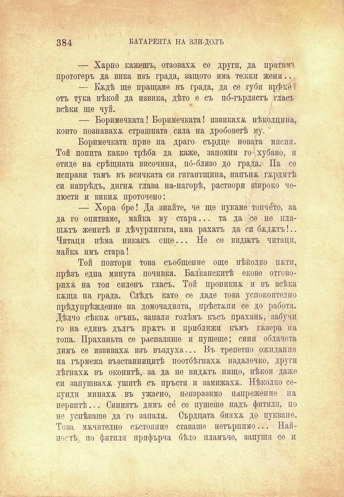

384

БАТАРЕЯТА НА ЗЛИ-ДОЛЪ

— Харно кажешъ, отзоваха се други, да пратимъ протогеръ да вика изъ града, защото има тежки жени...

— Кждѣ ще пращаме въ града, да се губя врѣме? отъ тука нѣкой да извика, дѣто е съ по́-гърлястъ гласъ всѣки ще чуй.

— Боримечката! Боримечката! извикаха нѣколцина, който познаваха страшната сила на дробоветѣ му. '

Боримечката прие на драго сърдце новата мисия. Той попита какво трѣба да каже, запомни го-хубаво, и отиде на срѣщната височина, по́-близо до града.' Па се неправи тамъ въ всичката си гигаптщипа, напънж гордитѣ си напрѣдъ, дигпж глава на-нагорѣ, раствори Широко челюсти и викнж проточено:

— Хора бре! Да знайте, че ще пукаме топче́то, за

да го опитваме, майка му стара... та шятъ женитѣ и дѣчурлигата, ама рахатъ Читаци нѣма никакъ още... Не се майка имъ стара!

Той повтори това съобщение още

да се не плада си бядятъ!.. в иджтъ читаци,

нѣколко ПЖТИ,

прѣзъ една минута почивка. Балканскитѣ екове отговорихж на тоя силенъ гласъ. Той проникна и въ всѣка кжща на града. Слѣдъ като се даде това успокоително прѣдупрѣждение на домочадията, прѣстѫпи се до работа. Дѣлно сѣкнж огънь, запали голѣмъ късъ прахань, забучи го на единъ дългъ пржтъ и приближи къмъ гжзера на топа. Праханьта се распаляше и пушеше; сини облачета димъ се извиваха изъ въздуха.... Въ трепетно ожпдан пе на гърмежа възстанницитѣ поотбѣгнахж надалечко, други лѣгнахж въ окопитѣ, за да не видятъ нищо, нѣкои даже сп запушваха ушитѣ съ пръсти и замижаха. Нѣколко секунди мппахя въ ужасно, неизразимо напрежение па нервитѣ... Синиятъ димъ со́ се пушеше надъ фитили, по не успѣваше да го запали. Сърдцата бияхж до пукване. Това мѫчително състояние ставаше нетърпимо... Найпослѣ, по фитили прифърча бѣло пламъче, запуши се и

