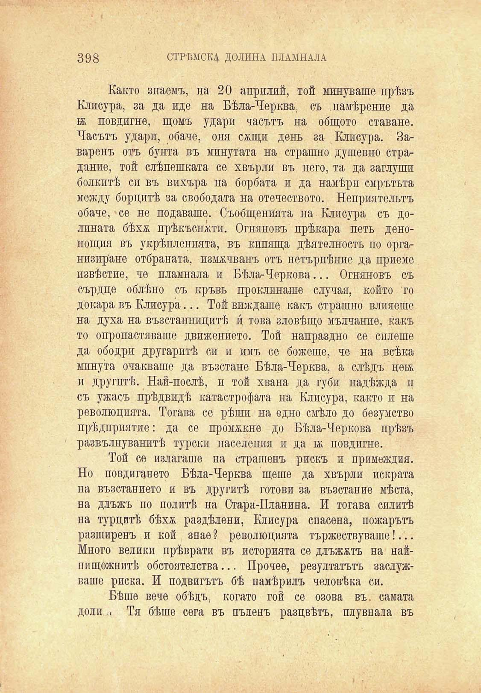

398

СТРѢМСКД ДОЛИНА ПЛАМНАЛА

Както знаемъ, на 20 априлий, той минуваше прѣзъ Клисура, за да иде на Бѣла-Черква, съ намѣрение да № повдигне, щомъ удари часътъ на общото ставане. Часътъ удари, обаче, оня салци день за Клисура. Заваренъ отъ бунта въ минутата на страшно душевно страдание, той слѣпешката се хвърли въ него, та да заглуши болкитѣ си въ вихъра на борбата и да намѣри смрътьта между борцитѣ за свободата на отечеството. Неприятельтъ обаче, се не подаваше. Съобщенията на Клисура съ долината бѣхѫ прѣкъснжти. Огняновъ прѣкара петь денонощия въ укрѣпленията, въ кипяща дѣятелность по организиране отбраната, измѫчванъ отъ нетърпѣние да приеме извѣстие, че пламнала и Бѣла-Черкова... Огняновъ съ сърдце облѣно съ кръвь проклинаше случая, който то докара въ Клисура... Той виждаше какъ страшно влияеше на духа на възстанницитѣ и́ това зловѣщо мълчание, какъ то опропастяваше движението. Той напраздно се сплете да ободри другаритѣ си и имъ се божеше, че на всѣка минута очакваше да възстане Бѣла-Черква, а слѣдъ цевь и другитѣ. Най-послѣ, и той хвана да губи надѣжда п съ ужасъ прѣдвидѣ катастрофата на Клисура, както и на революцията. Тогава се рѣши на едно смѣло до безумство прѣдприятие: да се промъкне до Бѣла-Черкова прѣзъ развълнуванитѣ турски населения и да тж повдигне.

Той се излагаше на страшенъ рискъ и примеждия. Но повдигането Бѣла-Черква щеше да хвърли искрата па възстанието и въ другитѣ готови за възстание мѣста, на длъжъ по политѣ на Стара-Планина. И тогава силитѣ на турцитѣ бѣхѫ раздѣлени, Клисура спасена, пожарътъ разширенъ и кой знае ? революцията тържествуваше!... Много велики прѣврати въ историята се длъжжтъ на найнпщожнитѣ обстоятелства... Прочее, резултатътъ заслужваше риска. И подвигътъ бѣ намѣрилъ человѣка си.

Бѣше вече обѣдъ, когато гой се озова въ. самата доли .« Тя бѣше сега въ пъленъ разцвѣтъ, плувнала въ

