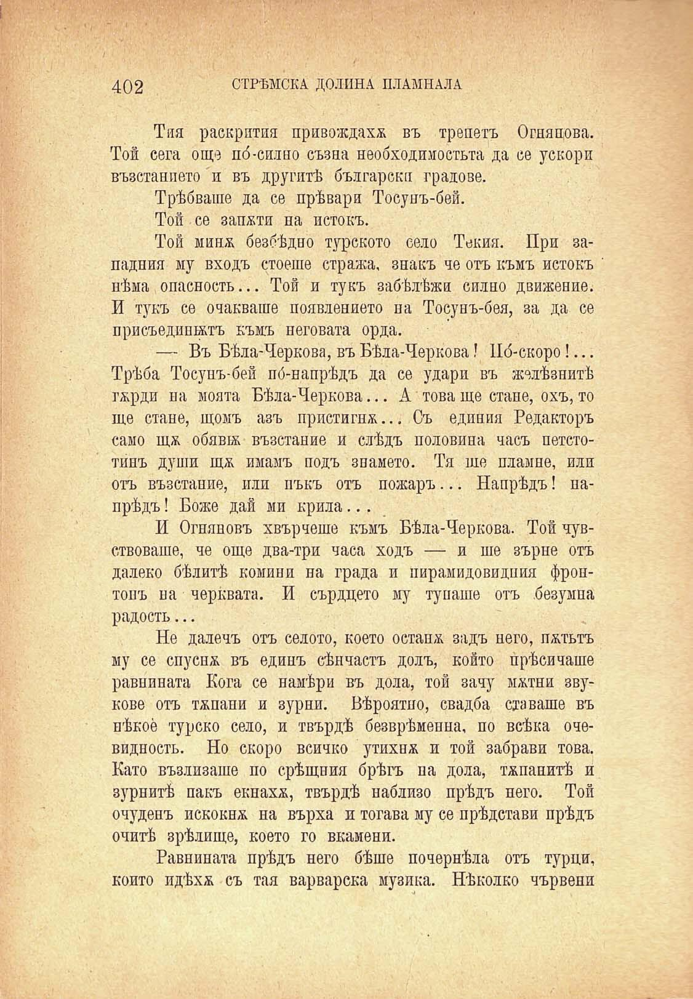

402	СТРѢМСКА ДОЛИНА ПЛАМНАЛА

Тия раскрития привождахж въ трепетъ Огнянова. Той сега още по́-силно съзна необходимостьта да се ускори възванието и въ другитѣ български градове.

Трѣбваше да се прѣвари Тосупъ-бей.

Той се запжти на истокъ.

Той минж безбѣдно турското село Текия. При западния му входъ стоеше стража, знакъ че отъ къмъ истокъ нѣма опасность... Той и тукъ забѣлѣжи силно движение. И тукъ се очакваше появлението па Тосунъ-бея, за да се присъединятъ къмъ неговата орда.

— Въ Бѣла-Черкова, въ Бѣла-ЧерковаНо́-скоро!... Трѣба Тосунъ-бей по́-напрѣдъ да се удари въ желѣзнитѣ гжрди па моята Бѣла-Черкова... А това ще етапе, охъ, то ще стане, щомъ азъ приети гнж... Съ единия Редакторъ само щж обявж възстание и слѣдъ половина часъ петстотинъ души щж имамъ подъ знамето. Тя ще пламне, или отъ възстание, или пъкъ отъ пожаръ... Напрѣдъ! папрѣдъ! Боже дай ми крила...

И Огняновъ хвърчеше къмъ Бѣла-Черкова. Той чувствоваше, че още два-три часа ходъ — и ше зърне отъ далеко бѣлитѣ комини на града и пирамидовидпия фронтопъ на черквата. И сърдцето му тупаше отъ безумна радость...

Не далечъ отъ селото, което остапж задъ него, пжтьтъ му се спуснж въ единъ сѣнчастъ долъ, който прѣсичаше равнината Кога се намѣри въ дола, той зачу мжтни звукове отъ тжпапи и зурни. Вѣроятно, свадба ставаше въ нѣкое турско село, и твърдѣ безврѣменна, по всѣка очевидность. Но скоро всичко утихнж и той забрави това. Като възлизаше по срѣщния брѣгъ па дола, тжпанитѣ и зурнитѣ пакъ екнахж, твърдѣ наблизо прѣдъ него. Той очуденъ искокнж на върха и тогава му се прѣдстави прѣдъ очитѣ зрѣлище, което го вкамени.

Равнината прѣдъ него бѣше почернѣла отъ турци, който идѣхѫ съ тая варварска музика. Нѣколко чървени

