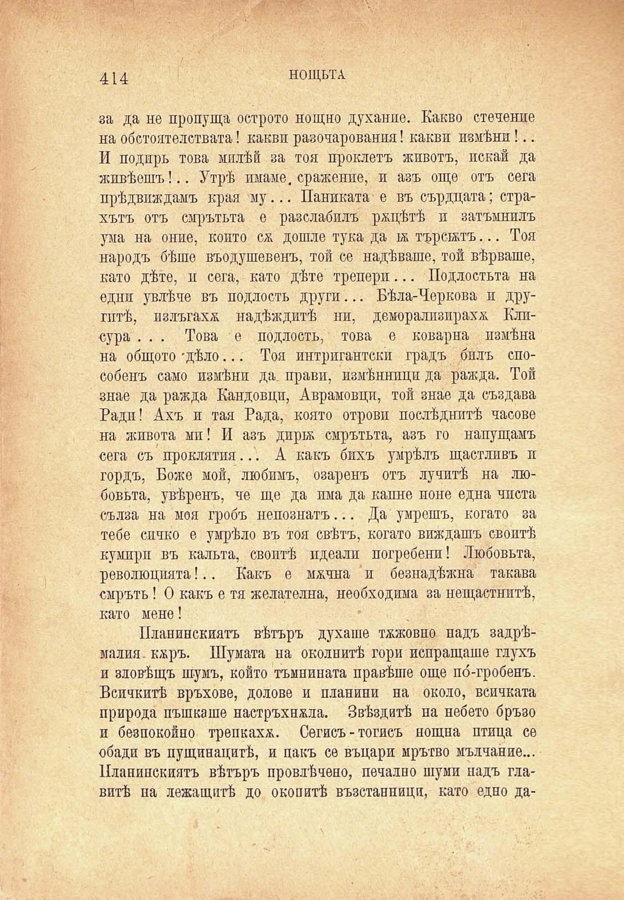

414	НОЩЬТА

за да не пропуща острото нощно духание. Какво стечение на обстоятелствата! какви разочарования! какви измѣни!.. И подиръ това милѣй за тоя проклетъ животъ, искай да живѣешъ!.. Утрѣ имаме, сражение, и азъ още отъ сега прѣдвиждамъ края му... Паниката е въ сърдцата; страхътъ отъ смрътьта е разслабилъ ржцѣтѣ и затъмнилъ ума на оние, който сѫ дошле тука да 1Ж търсилъ... Тоя народъ бѣше въодушевенъ, той се надѣваше, той вѣрваше, като дѣте, и сега, като дѣте трепери... Подлостьта на едни увлѣче въ подлость други... Бѣла-Черкова и другптѣ, пзлъгахж надѣждитѣ ни, деморализираха Клисура . . . Това е подлость, това е коварна измѣна на общото -дѣло... Тоя интригантски градъ билъ способенъ само измѣни да. прави, измѣнници да ражда. Той знае да ражда Кандовци, Аврамовци, той знае да създава Ради! Ахъ и тая Рада, която отрови послѣднитѣ часове на живота мп! И азъ дири смрътьта, азъ го напущамъ сега съ проклятия... А какъ бихъ умрѣлъ щастливъ п гордъ, Боже мой, любимъ, озаренъ отъ лунитѣ на любовьта, увѣренъ, че ще да има да капне поне една чпста сълза на моя гробъ непознатъ... Да умрешъ, когато за тебе синко е умрѣло въ тоя свѣтъ, когато виждашъ своитѣ кумири въ кальта, своитѣ идеали погребени! Любовьта, революцията!.. Какъ е мжчна и безнадѣжна такава смръть! О какъ е тя желателна, необходима за нещастнитѣ, като мене!

Планинскиятъ вѣтъръ духаше тжжовно надъ задрѣмалъ- кжръ. Шумата на околнитѣ гори испращаше глухъ и зловѣщъ шумъ, който тъмнината правѣше още по́-гробенъ. Всичкитѣ връхове, долове и планини на около, всичката природа пъшкаше настръхнжла. Звѣздитѣ на небето бръзо и безпокойно трепкахж. Сегисъ - тогисъ нощна птица се обади въ пущинацитѣ, и пакъ се въцари мрътво мълчание... Планинскиятъ вѣтъръ провлѣчено, печално шуми надъ главитѣ па лежащитѣ до окопитѣ възстанници, като едно да

