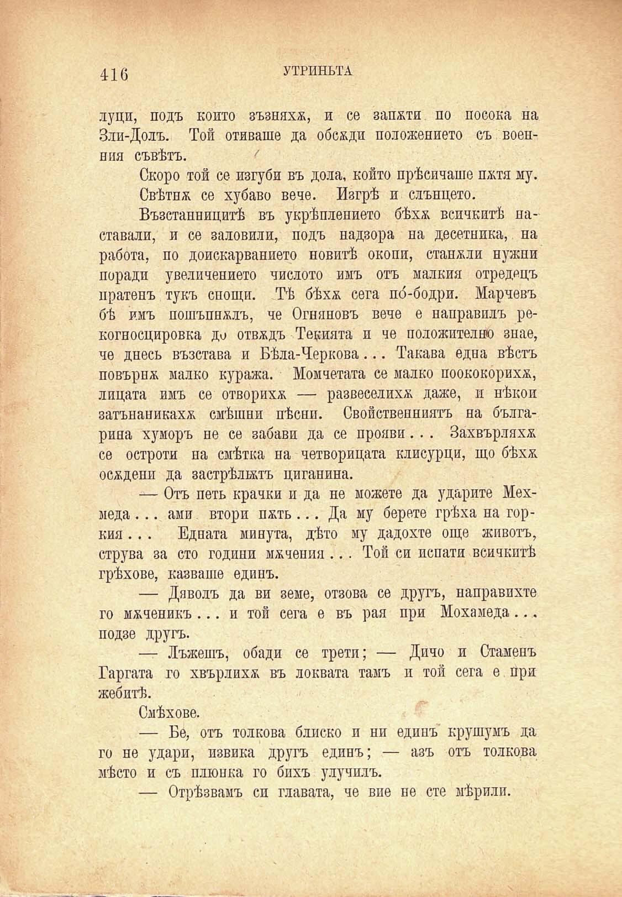

416	УТРИНЬТА

луци, подъ който зъзняхж, и се запоти по посока на Зли-Долъ. Той отиваше да обсади положението съ военния съвѣтъ. /

Скоро той се изгуби въ дола, който прѣсичаше пжтя му.

Свѣтнж се хубаво вече. Изгрѣ и слънцето.

Възстанницитѣ въ укрѣплението бѣхѫ всичкитѣ наставали, и се заловили, подъ надзора на десетника, на работа, по доискарванието новитѣ окопи, станжли нужни поради увеличението числото имъ отъ малкия отредецъ пратенъ тукъ снощи. Тѣ бѣхѫ сега по́-бодри. Марчевъ бѣ имъ пошъпнжлъ, че Огняновъ вече е направилъ рекогносцировка до отвждъ Текията и че положително знае, че днесъ възстава и Бѣла-Черкова... Такава една вѣстъ повърнж малко куража. Момчетата се малко поококорихж, лицата имъ се отворихж — развеселихж даже, и нѣкои затънаникахж смѣшни пѣсни. Свойственниятъ на българина хуморъ ие се забави да се прояви.. . Захвърляхж се остроти на смѣтка на четворицата клисурци, що бѣхж осждени да застрѣлььтъ циганина.

— Отъ петь крачки и да не можете да ударите Мехмеда ... ами втори пжть ... Да му берете грѣха на горкия .. . Едната минута, дѣто му дадохте още животъ, струва за сто години мжчения... Той си испати всичкитѣ грѣхове, казваше единъ.

— Дяволъ да ви земе, отзова се другъ, направихте го мжченикъ ... и той сега е въ рая при Мохамеда... подзе другъ.

— Лъжешъ, обади се трети; — Дичо и Стаменъ Гаргата го хвърлихж въ локвата тамъ и той сега е при жебитѣ.

Смѣхове.

— Бе, отъ толкова блиско и ни единъ крушумъ да го не удари, извика другъ единъ; — азъ отъ толкова мѣсто и съ плюнка го бихъ улучилъ.

— Отрѣзвамъ си главата, че вие пе сте мѣрили.

