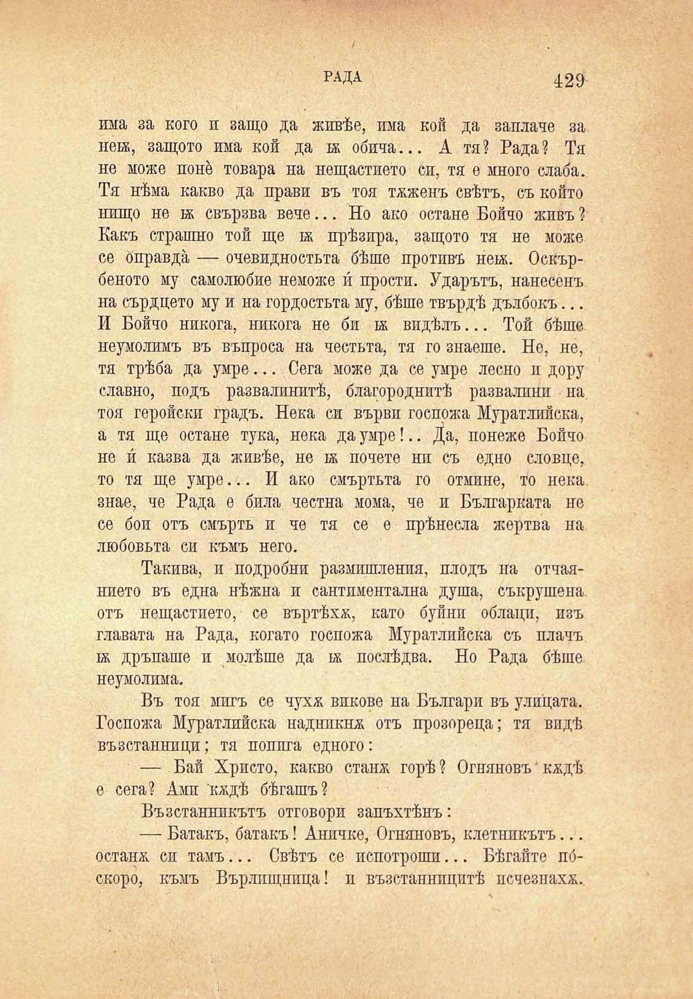

РАДА

429-

има за кого и защо да живѣе, има кой да заплаче за невк, защото има кой да бк обича... А тя? Рада? Тя не може понб товара на нещастието си, тя е много слаба. Тя нѣма какво да нрави въ тоя тжженъ свѣтъ, съ който нищо не бк свързва вече... Но ако остане Бойчо живъ ? Какъ страшно той ще нк прѣзира, защото тя не може се оправда — очевидностьта бѣше противъ неьк. Оскърбеното му самолюбие неможе и́ прости. Ударътъ, нанесенъ на сърдцето му и на гордостьта му, бѣше твърдѣ дълбокъ... И Бойчо никога, никога не би бк видѣлъ... Той бѣше неумолимъ въ въпроса на честьта, тя го знаеше. Не, не, тя трѣба да умре... Сега може да се умре лесно и дору славно, подъ развалинитѣ, благороднитѣ развалини на тоя геройски градъ. Нека си върви госпожа Муратлийска, а тя ще остане тука, нека да умре!.. Да, понеже Бойчо не и́ казва да живѣе, не бк почете ни съ едно словце, то тя ще умре... И ако смъртьта го отмине, то нека, знае, че Рада е била честна мома, че и Българката не се бои отъ смърть и че тя се е прѣнесла жертва на любовьта си къмъ него.

Такива, и подробни размишления, плодъ иа отчаянието въ една нѣжна и сантиментална душа, съкрушена отъ нещастието, се въртѣхѫ, като буйни облаци, изъ главата на Рада, когато госпожа Муратлийска съ плачъ бк дръпаше и молѣше да бк послѣдва. Но Рада бѣше неумолима.

Въ тоя мигъ се чухѫ викове на Българи въ улицата. Госпожа Муратлийска надникна отъ прозореца; тя впдѣ възстанници; тя поппга едното:

— Бай Христо, какво станж горѣ? Огняновъ*кждѣ е сега? Ами кждѣ бѣгашъ?

Възстаннпкътъ отговори запъхтѣнъ:

— Батакъ, батакъ! Аничке, Огняновъ, клетникътъ... останж си тамъ... Свѣтъ се исиотроши... Бѣгайте пбскоро, къмъ Върлпщница! и възстаннпцитѣ псчезнахѫ..

