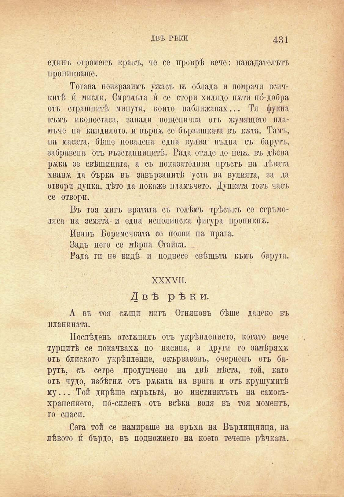

ДВѢ РѢКИ

431

единъ огроменъ кракъ, че се проврѣ вече: нападательтъ проникваше.

Тогава неизразимъ ужасъ ж облада и помрачи всичкитѣ и́ мисли. Смрътьта и́ се стори хилядо пати по́-добра отъ страшнитѣ минути, който наближавах... Тя фукна къмъ иконостаса, запали вощеничка отъ жумящето пламъче на кандилото, и върн& се бързпшката въ кжта. Тамъ, на масата, бѣше поваляна една вулия пълна съ барутъ, забранена отъ възстанницитѣ. Рада отиде до ненц въ дѣсна ржка зе свѣщицата, а съ показателния пръсть на лѣвата хван/К да бърка въ завързацитѣ уста на вулията, за да отвори дупка, дѣто да покаже пламъчето. Дупката тозъ часъ се отвори.

Въ тоя мигъ вратата съ голѣмъ трѣсъкъ се сгръмоляса на земята- и една исполинска фигура проникна.

Иванъ Боримечката се появи па прага.

Задъ пего се мѣрна Станка. .

Рада ги пе видѣ и поднесе свѣщьта къмъ барута.

XXXVII.

Двѣ рѣки.

А въ тоя сжщи мигъ Огняновъ бѣше далеко въ планината.

Послѣденъ отстѫпилъ отъ укрѣплението, когато вече турцитѣ се покачваха по насипа, а други го замѣряха отъ блиското укрѣпление, окървавенъ, очерненъ отъ барутъ, съ сетре продупчено на двѣ мѣста, той, като отъ чудо, избѣгна отъ рѣката на врага и отъ крушумитѣ му... Той дирѣше смрътьта, но инстинктътъ на самосъхранението, по́-силенъ отъ всѣка воля въ тоя моментъ, го спаси.

Сега той се намираше на връха на Върлищница, па лѣвото и́ бърдо, въ подножието на което течеше рѣчната.

