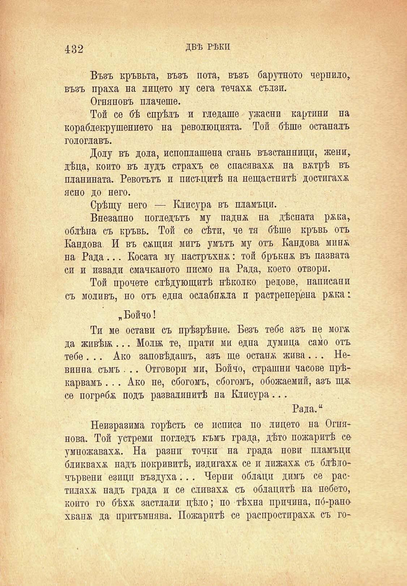

432

ДВѢ РѢКИ

Възъ кръвьта, възъ нота, възъ барутното чернило, възъ праха на лицето му сега течаха сълзи.

Огняновъ плачеше.

Той се бѣ спрѣлъ и гледаше ужасни картини на кораблекрушението на революцията. Той бѣше останалъ гологлавъ.

Долу въ дола, испоплашена сгань възстанници, жени, дѣца, който въ лудъ страхъ се спасяваха на вжтрѣ въ планината. Роботътъ и писъцитѣ на нещастнитѣ достигахѫ ясно до него.

Срѣщу него — Клисура въ пламъци. .

Внезапно погледътъ му паднж на дѣсната ржка, облѣна съ кръвь. Той се сѣти, че тя бѣше кръвь отъ Кандова. И въ сжтция мигъ умътъ му отъ Кандова минж. на Рада... Косата му настръхна: той бръкнж въ пазвата си и извади смачканото писмо на Рада, което отвори.

Той прочете слѣдующитѣ нѣколко рецове, написани съ моливъ, но отъ една ослабнжла и растреперена ржка:

„Бойчо!

Ти ме остави съ прѣзрѣние. Безъ тебе азъ не могж да живѣж... Молб& те, прати ми една думица само отъ тебе . .. Ако заповѣдашъ, азъ ще остана жива ... Не* винна съмъ . .. Отговори ми, Бойчо, страшни часове прѣ* карвамъ. .. Ако не, сбогомъ, сбогомъ, обожаемий, азъ щж. се погребж подъ развалинитѣ па Клисура...

Рада.“

Неизразима горѣсть се исписа по лицето на Огнянова. Той устреми погледъ къмъ града, дѣто пожаритѣ се умпожавахѫ. На разни точки на града нови пламъци бликвахѫ надъ покривитѣ, издигахѫ се и лижахѫ съ блѣлочървени езици въздуха;.. Черни облаци димъ се растилахѫ надъ града и се сливахѫ съ облацитѣ на небето, който го бѣхѫ застлали цѣло; по тѣхна причина, по́-рано хвапж да притъмнява. Пожаритѣ се распростирахѫ съ го

