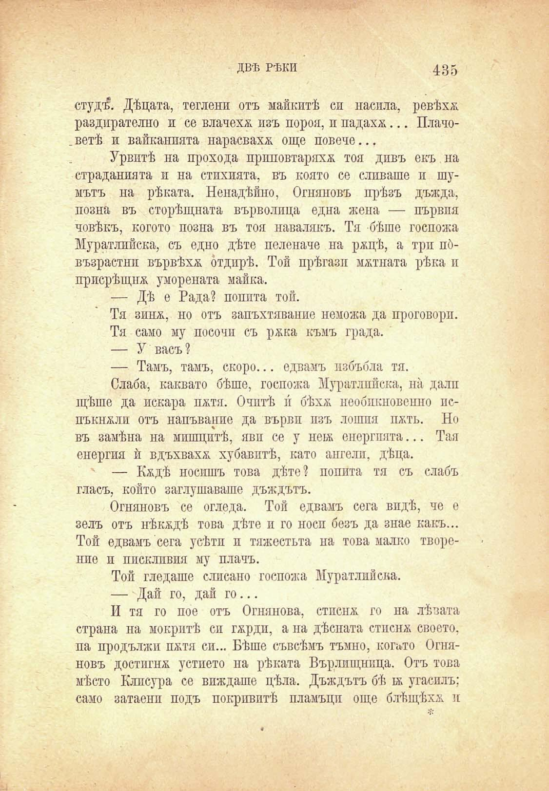



двѣ рѣки	435

студъ. Дѣцата, теглени отъ майкитѣ си насила, ревѣхѫ раздирателно и се влачеха изъ пороя, и падахж... Плачоветѣ и вайканията нарасвахѫ още повече...

Урвитѣ на прохода приповтаряха тоя дивъ екъ на страданията и на стихията, въ която се сливаше и шумътъ на рѣката. Ненадѣйно, Огняновъ прѣзъ дъжда, позна въ сторѣщната върволица една жена — първия човѣкъ, когото позна въ тоя навалянъ. Тя бѣше госпожа Муратлийска, съ едно дѣте пеленаче на ржцѣ, а три пбвъзрастнп вървѣхѫ о́тдирѣ. Той прѣгази мжтната рѣка и присрѣщнж уморената майка.

— Дѣ е Рада? попита той.

Тя зинж, но отъ запъхтяваний неможа да проговори.

Тя само му посочи съ ржка къмъ града.

— У васъ ?

— Тамъ, тамъ, скоро... едвамъ пзбъбла тя.

Слаба, каквато бѣше, госпожа Муратлийска, на дали щѣше да искара пжтя. Очитѣ и́ бѣхѫ необикновений пспъкнжли отъ напъваме да върви изъ лошия пжть. Но въ замѣна на мишцитѣ, яви се у негж енергията... Тая енергия ѝ вдъхвахѫ хубавитѣ, като ангели, дѣца.

— Кждѣ носишъ това дѣте? попита тя съ слабъ гласъ, който заглушаваше дъждътъ.

Огняновъ се огледа. Той едвамъ сега впдѣ, че е зелъ отъ нѣкждѣ това дѣте и го носи безъ да знае какъ... Той едвамъ сега усѣти и тяжестьта на това малко творенпе и пискливия му плачъ.

Той гледаше слисано госпожа Муратлийска.

— Дай го, дай го...

И тя го пое отъ Огнянова, стисна; го иа лѣвата, страна па мокритѣ си гжрдп, а на дѣсната стиснж своето, па продължи пжтя си... Бѣше съвсѣмъ тъмно, когато Огняновъ достигнж устието иа рѣката Върлищнпца. Отъ топа мѣсто Клисура се виждаше цѣла. Дъждътъ бѣ 1ж угасилъ: само затаени подъ покривитѣ пламъци още блѣщѣха; п

