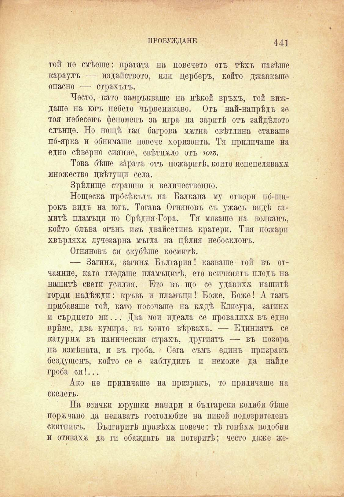

ПРОБУЖДАНЕ

441

той не смѣеше: вратата на повечето отъ тѣхъ пазѣше караулъ — издайството, или церберъ, който джавкаше опасно — страхътъ.

Често, като замръкваше на нѣкой връхъ, той виждаше на югъ небето чървеникаво. Отъ най-напрѣдъ зе тоя небесенъ феноменъ за игра на заритѣ отъ зайдѣлото слънце. Но нощѣ тая багрова мжтна свѣтлина ставаше пб-ярка и обнимаше повече хоризонта. Тя приличаше на едно сѣверно сияние, свѣтнжло отъ югъ.

Това бѣше зѝрата отъ пожаритѣ, който испепелявахѫ множество цвѣтущи села.

Зрѣлище страшно и величествений.

Нощеска прбсѣкътъ на Балкана му отвори по́-шпрокъ видъ на югъ. Тогава Огняновъ съ ужасъ видѣ самитѣ пламъци по Срѣдня-Гора. Тя мязаше на волканъ, който блъва огънь изъ двайсетина кратери. Тия пожари хвърляха лучезарна мъгла на цѣлия небосклонъ.

Огняновъ си скубѣше космитѣ.

— Загина, загина България! казваше той въ отчаяние, като гледаше пламъцитѣ, ето всичкиятъ плодъ на нашитѣ свети усилия. Ето въ що се удавихѫ нашитѣ горди надѣжди: кръвь и пламъци! Боже, Боже! А тамъ прибавяше той, като посочаше на кждѣ Клисура, загинж и сърдцето ми... Два мои идеала се провалихѫ въ едно врѣме, два кумира, въ който вѣрвахъ. — Единиятъ се катурнж въ паническия страхъ, другиятъ — въ позора на измѣната, и въ гроба. Сега съмъ единъ призракъ бездушенъ, който се е заблудилъ и неможе да найде гроба си!...

Ако не приличаше па призракъ, то приличаше па скелетъ.

На всички юрушки мандри и български колиби бѣше порѫчано да подаватъ гостолюбие на никой подозрителенъ скитникъ. Българитѣ правѣхѫ повече: тѣ гонѣхѫ подобни и отивахѫ да ги обаждатъ на потеритѣ; често даже же

