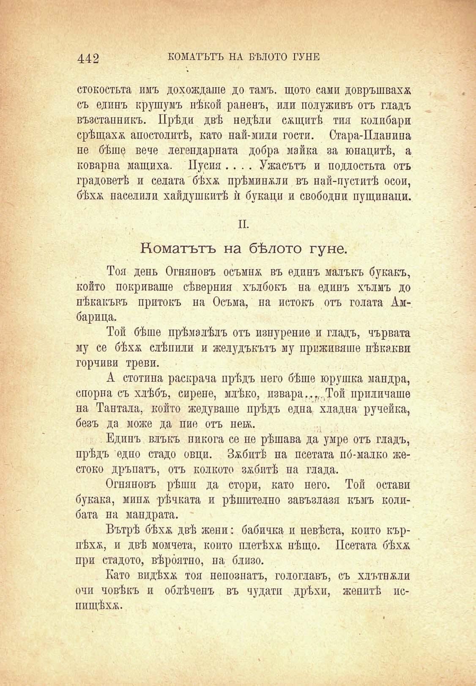

442

КОМАТЪТЪ НА БѢЛОТО ГУНЕ

стокостьта имъ дохождаше до тамъ, щото сами довръшвахѫ съ едпнъ крушумъ нѣкой раненъ, или полуживъ отъ гладъ възстанникъ. Прѣди двѣ недѣли сжщитѣ тия колибари срѣщаха апостолитѣ, като най-мили гости. Стара-Планина не бѣше вече легендарната добра майка за юнацитѣ, а коварна мащиха. Пусия .... Ужасътъ и подлостьта отъ градоветѣ и селата бѣхѫ прѣмипжли въ най-пуститѣ осои, бѣхѫ паселили хайдушкитѣ ѝ букаци и свободни пущинаци.

II.

Коматътъ на бѣлото гуне.

Тоя день Огняновъ осъмнж въ единъ малъкъ букакъ, който покриваше сѣверния хълбокъ на единъ хълмъ до нѣкакъвъ притокъ на Осъма, на истокъ отъ голата Амбарица.

Той бѣше прѣмалѣлъ отъ изнурение и гладъ, чървата му се бѣхѫ слѣпили и желудъкътъ му прѣживяше нѣкакви горчиви треви.

А стотина раскрача прѣдъ него бѣше юрушка мандра, спорна съ хлѣбъ, сирене, млѣко, извара......Той приличаше на Тантала, който жедуваше прѣдъ една хладна ручейна, безъ да може да пие отъ пекъ.

Едипъ влъкъ никога се пе рѣшава да умре отъ гладъ, прѣдъ едно стадо овци. Зжбитѣ на псетата по́-малко жестоко дръпатъ, отъ колкото зжбитѣ па глада.

Огняновъ рѣши да стори, като него. Той остави букака, минж рѣчната и рѣшително завъзлазя къмъ колибата на мандрата.

Вътрѣ бѣхѫ двѣ жени: бабичка и невѣста, който кърпѣхѫ, и двѣ момчета, копто плетѣхѫ нѣщо. Псетата бѣхѫ при стадото, вѣроятно, на близо.

Като видѣхѫ тоя непознатъ, гологлавъ, съ хлътпжли очи човѣкъ и облѣченъ въ чудати дрѣхи, женитѣ испищѣхѫ.

