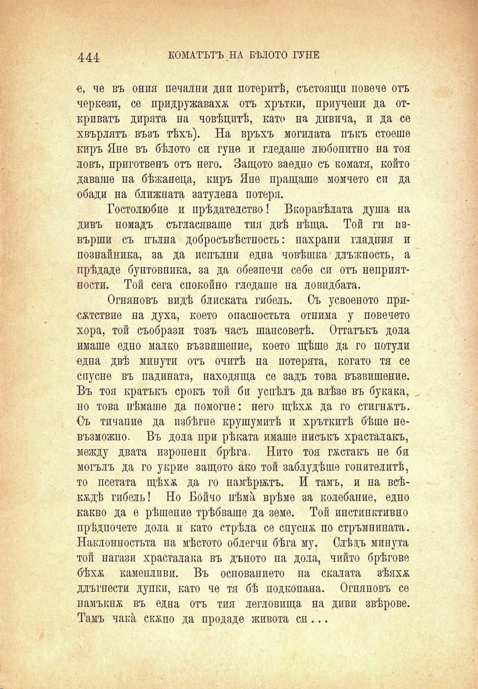

444	КОМАТЪТЪ НА БѢЛОТО ГУНЕ

е, че въ ония печални дни потеритѣ, състоящи повече отъ черкези, се придружаваха отъ хрътки, приучени да откриватъ дирята на човѣцитѣ, като на дивича, и да се хвърлятъ възъ тѣхъ). На връхъ могилата пъкъ стоеше киръ Яне въ бѣлото си гуне и гледаше любопитно на тоя ловъ, приготвенъ отъ него. Защото заедно съ коматя, който даваше на бѣжанеца, киръ Япе пращаше момчето си да обади на ближната затулена потеря.

Гостолюбие и прѣдателство! Вкоравѣлата душа на дивъ номадъ съгласяваше тия двѣ нѣща. Той ги извърши съ пълна добросъвѣстность: нахрани гладния и познайника, за да непълни едва човѣшка длъжность, а прѣдаде бунтовника, за да обезпечи себе си отъ неприятности. Той сега спокойно гледаше на ловидбата.

Огняновъ видѣ блиската гибель. Съ усвоеното присжтствие на духа, което опасностьта отнима у повечето хора, той съобрази тозъ часъ шансоветѣ. Оттатъкъ дола имаше едно малко възвишение, което щѣше да го потули една двѣ минути отъ очитѣ на потерята, когато тя се спусне въ падината, находища се задъ това възвишение. Въ тоя кратъкъ срокъ той би успѣлъ да влѣзе въ букака, но това нѣмаше да помогне: него щѣха да го стигнатъ. Съ тичание да избѣгне крушумитѣ и хръткитѣ бѣше невъзможно. Въ дола при рѣката имаше нисъкъ храсталакъ, между двата изропени брѣга. Нито тоя гѫстакъ не би могълъ да го укрие защото ако той заблудѣше гонителитѣ, то псетата щѣхѫ да го намѣрятъ. И тамъ, и па всѣкждѣ гибель! Но Бойчо нѣма врѣме за колебание, едно какво да е рѣшение трѣбваше да земе. Той инстинктивно прѣдпочете дола и като стрѣла се спусна по стръмнината. Наклонностьта на мѣстото облегни бѣга му. Слѣдъ минута той нагази храсталака въ дъното на дола, чийто брѣгове бѣхѫ каменливи. Въ основанието на скалата зѣяхѫ длъгнести дупки, като че тя бѣ подкопана. Огняновъ се намъкпж въ една отъ тпя легловища на диви звѣрове. Тамъ чака скжпо да продаде живота си...

