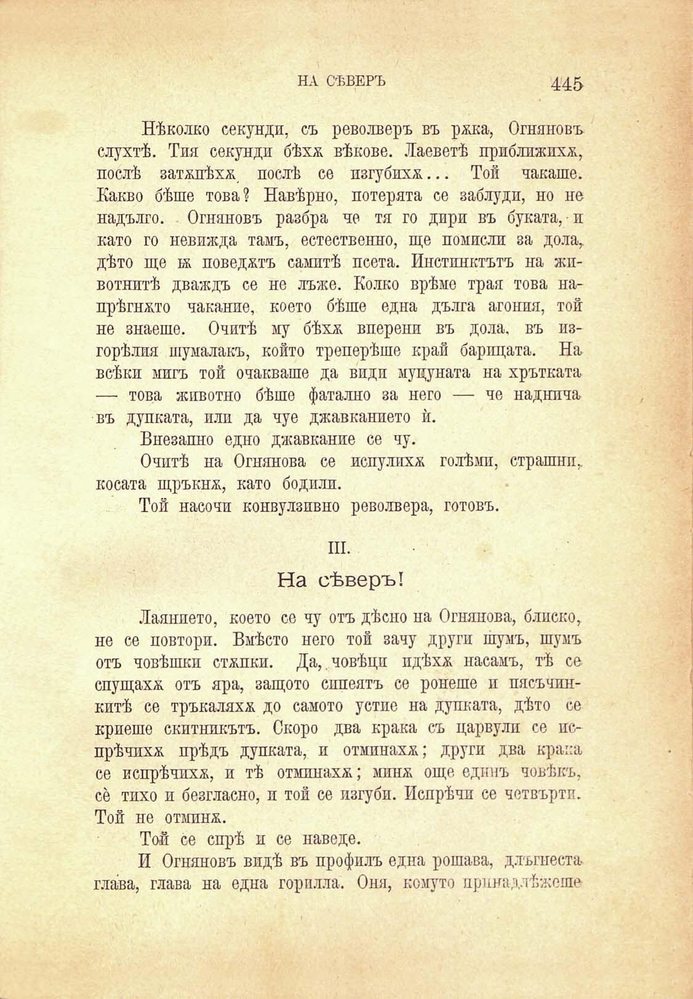

НА СѢВЕРЪ

445

Нѣколко секунди, съ револверъ въ ржка, Огняновъ слухтѣ. Тия секунди бѣхѫ вѣкове. Лаеветѣ приближпхѫ, послѣ затжпѣхѫ, послѣ се пзгубихѫ... Той чакаше. Какво бѣше това? Навѣрно, потерята се заблуди, но не надълго. Огняновъ разбра че тя го дири въ буката, и като го невижда тамъ, естественно, ще помисли за дола, дѣто ще бк поведжтъ самитѣ псета. Инстинктътъ на жпвотнитѣ дваждъ се не лъже. Колко врѣме трая това напрѣгнжто чаканпе, което бѣше една дълга агония, той не знаеше. Очитѣ му бѣхѫ вперени въ дола, въ изгорѣлия шумалакъ, който треперѣше край барпцата. На всѣки мигъ той очакваше да види муцуната на хрътката — това животно бѣше фатално за него — че наднича въ дупката, или да чуе джавканпето ѝ.

Внезапно едно джавкание се чу.

Очитѣ на Огнянова се испулпхѫ голѣми, страшни, косата щръкнж, като бодили.

Той насочи конвулзивно револвера, готовъ.

III.

На сѣверъ!

Лаянпето, което се чу отъ дѣсно па Огнянова, блиско, не се повтори. Вмѣсто него той зачу други шумъ, шумъ отъ човѣшки стжпки. Да, човѣци пдѣхѫ насамъ, тѣ се спущахѫ отъ яра, защото сипеятъ се ронеше и пясъчинкитѣ се тръкаляхѫ до самото устие на дупката, дѣто се криеше скитникътъ. Скоро два крака съ царвули се испрѣчихѫ прѣдъ дупката, и отминахѫ; други два крака се испрѣчихѫ, и тѣ отминахѫ; минж още едпнъ човѣкъ, се тихо и безгласно, и той се изгуби. Попрѣчи се четвърти. Той не отмпнж.

Той се спрѣ и се наведе.

И Огняновъ видѣ въ профилъ една рошава, длъгнеста глава, глава на една горплла. Оня, комуто ярина д. Нижеше

