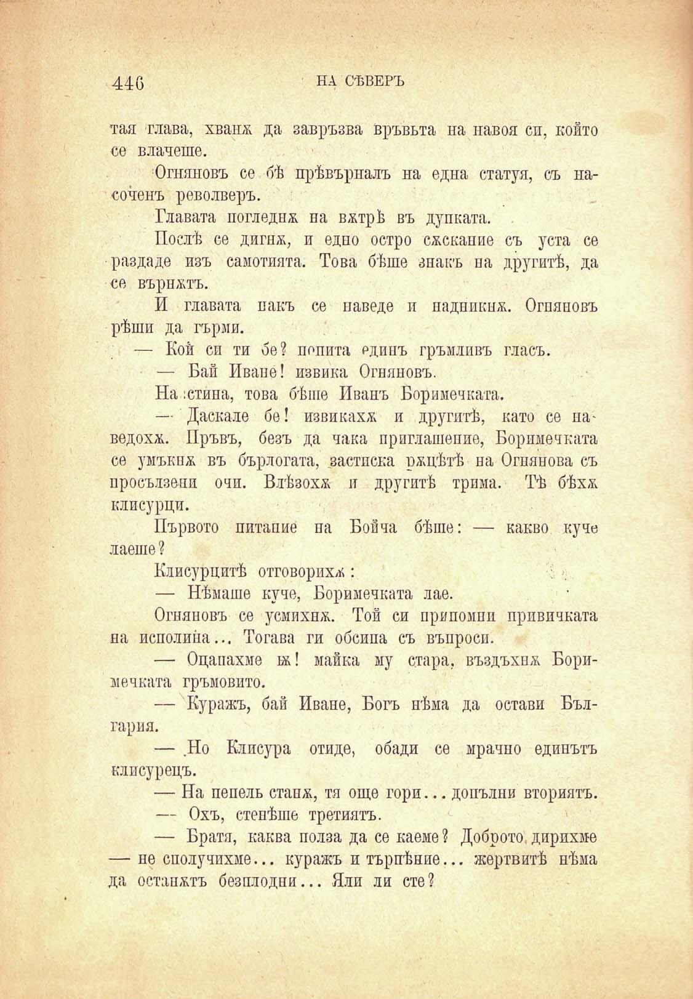

446	НА СѢВЕРЪ

тая глава, хванж да завръзва връвьта на навоя сп, който се влачеше.

Огняновъ се бѣ прѣвърналъ на една статуя, съ насоченъ револверъ.

Главата погледна на вжтрѣ въ дупката.

Послѣ се дигнж, и едно остро сжскание съ уста се раздаде изъ самотната. Това бѣше знакъ па другитѣ, да се върнжтъ.

И главата пакъ се наведе н паднпкнж. Огпяповъ рѣши да гърми.

— Кой си ти бе? попита единъ гръмливъ гласъ.

— Бай Иване! извика Огняновъ.

На :стипа, това бѣше Иванъ Боримечката.

— Даскале бе! извикаха и другитѣ, като се паведохѫ. Пръвъ, безъ да чака приглашение, Боримечката се умъкнж въ бърлогата, застпска ржцѣтѣ на Огнянова съ просълзено очи. Влѣзохѫ и другитѣ трима. Тѣ бѣхѫ. клисурци.

Първото питание па Бойча бѣше: — какво куче лаеше ?

Клисурцитѣ отговорихѫ:

— Нѣмаше куче, Боримечката лае.

Огняновъ се усмихнж. Той си припомни привичката на исполипа... Тогава ги обсипа съ въпроси.

— Оцапахме 1ж! майка му стара, въздъхна; Боримечката гръмовито.

— Куражъ, бай Иване, Богъ нѣма да остави България.

— Но Клисура отиде, обади се мрачно единътъ клисурецъ.

— На пепель стапж, тя още гори... допълни вториятъ.

— Охъ, стелѣше третиятъ.

— Братя, каква полза да се каеме? Доброто, дирихме — не сполучихме... куражъ итърпѣние... жертвитѣ нѣма да останжтъ безплодни... Яли ли сте?

