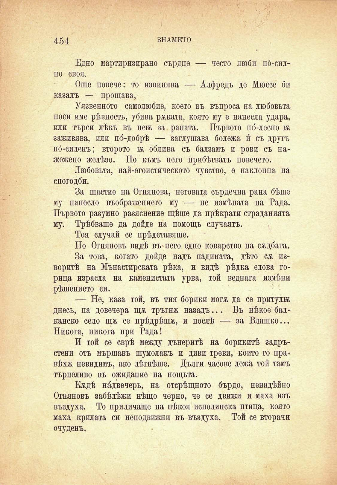

1	V

454.	знамето

Едно мартиризирано сърдце — често люби по́-силно своя.

Още повече: то извинява — Алфредъ де Мюссе би казалъ — прощава,

Уязвенното самолюбие, което въ въпроса на любовьта носи име рѣвность, убива рѣката, която му е нанесла удара, или търси лѣкъ въ цевь за . раната. Първото по́-лесно въ заживява, или по́-добрѣ — заглушава бодежа и́ съ другъ пб-силенъ; второто бк облива съ балзамъ и рови съ нажежено желѣзо. Но къмъ него прибѣгватъ повечето.

Любовьта, най-егоистическото чувство, е наклонна на спогодби.

За щастие на Огнянова, неговата сърдечна рана бѣше му нанесло въображението му — не измѣната на Рада. Първото разумно разяснение щѣше да прѣкрати страданията му. Трѣбваше да дойде на помощь случаятъ.

Тоя случай се прѣдставяше.

Но Огняновъ видѣ въ него едно коварство на сѫдбата.

За това, когато дойде надъ падината, дѣто сѫ изворитѣ на Манастирската рѣка, и видѣ рѣдка елова горица израсла на каменистата урва, той веднага измѣни рѣшението си.

— Не, каза той, въ тия борики могж да се притули днесъ, па довечера щж тръгнж назадъ... Въ нѣкое балканско село щж се прѣдрѣшж, и послѣ — за Влашко... Никога, никога при Рада!

И той се сврѣ между дънеритѣ на борикитѣ задръстени отъ мършавъ шумолакъ и диви треви, който го правѣхѫ невидимъ, ако лѣгнѣше. Дълги часове лежа той тамъ търпеливо въ ожидание на нощьта.

Кждѣ надвечерь, на отсрѣщното бърдо, ненадѣйно Огняновъ забѣлѣжи нѣщо черно, че се движи и маха изъ въздуха. То приличаше на нѣкоя исполинска птица, която маха крилата си неподвижни въ въздуха. Той се вторачи очуденъ.

