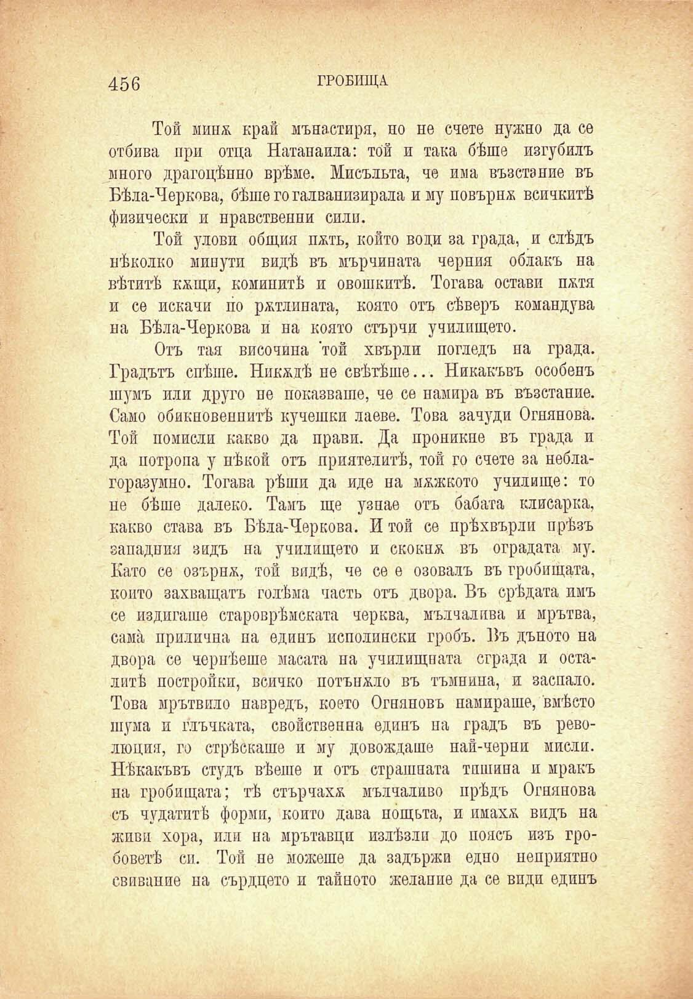

456

ГРОБИЩА

Той минж край мънастиря, но не счете нужно да се отбива при отца Натанаила: той и така бѣше изгубилъ много драгоцѣнно врѣме. Мисъльта, че има възстание въ Бѣла-Черкова, бѣше го галванизирала и му повърня всичкитѣ физически и правственпи сило.

Той улови общия пжть, който води за града, и слѣдъ нѣколко минути видѣ въ мърчината черния облакъ на вѣтитѣ кжщи, коминитѣ и овошкитѣ. Тогава остави пжтя и се искани по рътлината, която отъ сѣверъ командува на Бѣла-Черкова и на която стърчи училището.

Отъ тая височина той хвърли погледъ па града. Градътъ спѣше. Никждѣ пе свѣтѣше... Никакъвъ особенъ шумъ или друго пе показваше, че се намира въ възстание. Само обикновенпитѣ кучешки лаеве. Това зачуди Огнянова. Той помисли какво да прави. Да проникне въ града и да потропа у нѣкой отъ приятелитѣ, той го счете за неблагоразумно. Тогава рѣши да иде на мжжкото училище: то не бѣше далеко. Тамъ ще узнае отъ бабата клисарка, какво става въ Бѣла-Черкова. И той се прѣхвърли прѣзъ западния зидъ на училището и скокнж въ оградата му. Като се озърнж, той видѣ, че се е озовалъ въ гробищата, копто захващатъ голѣма часть отъ двора. Въ срѣдата имъ се издигаше староврѣмската черква, мълчалива и мрътва, сама прилична па единъ исполински гробъ. Въ дъното на двора се чернѣеше масата на училищната сграда и осталитѣ постройки, всичко потънжло въ тъмнина, и заспало. Това мрътвило навредъ, което Огняновъ намираше, вмѣсто шума и глъчката, свойственна едпнъ на градъ въ революция, го стрѣскаше и му довождаше пай-черни мисли. Нѣкакъвъ студъ вѣеше и отъ страшната тишина и мракъ на гробищата; тѣ стърчахѫ мълчаливо прѣдъ Огнянова съ чудатитѣ форми, който дава нощьта, и имахѫ видъ на живи хора, или на мрътавци излѣзли до поясъ изъ гробоветѣ си. Той не можеше да задържи едно неприятно свивание на сърдцето и тайното желаппе да се впдп единъ

