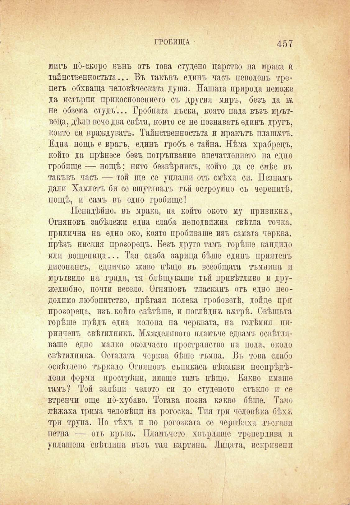

ГРОБИЩА

457

мигъ по́-скоро вънъ отъ това студено царство на мрака й тайпственностьта... Въ такъвъ единъ часъ неволенъ трепетъ обхваща человѣческата душа. Нашата природа неможе да истърпи прикосновението съ другия миръ, безъ да 1ъ не обзема студъ... Гробната дъска, която пада възъ мрътвеца, дѣлп вече два свѣта, който се пе познаватъ едпнъ друга, който си враждуватъ. Тайнствепностьта и мракътъ платътъ. Една нощь е врагъ, единъ гробъ е тайна. Нѣма храбрецъ, който да прѣнесе безъ потръпвание впечатлението па едно гробище — нощѣ; пито безвѣрникъ, който да се смѣе въ такъвъ часъ — той ще се уплаши отъ смѣха си. Незнамъ дали Хамлетъ би се вшутявалъ тъй остроумно съ черепитѣ, нощѣ, и самъ въ едно гробище!

Ненадѣйно, въ мрака, на който окото му привикна, Огняновъ забѣлежи една слаба неподвижна свѣтла точка, прилична на едно око, която пробиваше изъ самата черква, прѣзъ ниския прозорецъ. Безъ друго тамъ горѣше кандило или вощеница... Тая слаба зарида бѣше единъ приятенъ дисонансъ, едничко живо нѣщо въ всеобщата тъмнина п мрътвило па града, тя блѣщукаше тъй привѣтливо и дружелюбно, почти весело. Огняновъ тласканъ отъ едно неодолимо любопитство, прѣгази полека гробоветѣ, дойде при прозореца, изъ който свѣтѣше, и поглѣднъ вътрѣ. Свѣщьта горѣше прѣдъ една колона на черквата, па голѣмия пиринченъ свѣтилникъ. Мъжделивото пламъче едвамъ освѣтляваше едно малко околчасто пространство па пола, около свѣтилника. Осталата черква бѣше тъмна. Въ това слабо освѣтлепо търкало Огпяповъ съпикаса нѣкакви пеопрѣдѣлени форми прострѣни, имаше тамъ нѣщо. Какво имаше тамъ? Той залѣпи челото си до студеното стъкло и се втренчи още нб-хубаво. Тогава позна какво бѣше. Тамо лѣжаха трима человѣци иа рогоска. Тия три человѣка бѣхъ три трупа. По тѣхъ и по рогозката се чернѣяха лъскави петна — отъ кръвь. Пламъчето хвърляше треперлива и уплашена свѣтлина възъ тая картина. Лицата, искри вени

