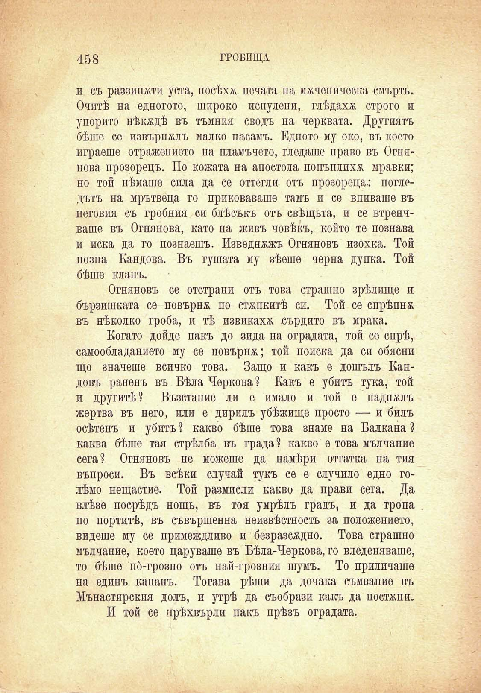

458

ГРОБИЩА

и съ раззината уста, носѣха печата на мѫченическа смърть. Очитѣ на едногото, широко испулени, глѣдахѫ строго и упорито нѣкѫдѣ въ тъмния сводъ па черквата. Другиятъ бѣше се извърналъ малко насамъ. Едното му око, въ което играеше отражението на пламъчето, гледаше право въ Огнянова прозорецъ. По кожата на апостола попъплихя мравки; по той нѣмаше сила да се оттегли отъ прозореца; поглрдътъ на мрътвеца го приковаваше тамъ и се впиваше въ неговия съ гробния си блѣсъкъ отъ свѣщьта, и се втренчваше въ Огнянова, като на живъ човѣкъ, който те познава и иска да го познаешъ. Изведнъжъ Огняновъ изохка. Той позна Кандова. Въ гушата му зѣеше черна дупка. Той бѣше кланъ.

Огняновъ се отстрани отъ това страшно зрѣлище и бързишката се повърна по стѫпкитѣ сп. Той се спрѣпнх въ нѣколко гроба, и тѣ извикаха сърдито въ мрака.

Когато дойде пакъ до зида на оградата, той се спрѣ, самообладанието му се повърня; той поиска да си обясни що значеше всичко това. Защо и какъ е дошълъ Кандовъ раненъ въ Бѣла Чернова? Какъ е убитъ тука, той и другитѣ? Възстание ли е имало и той е падналъ жертва въ него, или е дирилъ убѣжище просто — и билъ осѣтенъ и убитъ ? какво бѣше това знаме на Балкана ? каква бѣше тая стрѣлба въ града? какво е това мълчание сега? Огняновъ не можеше да намѣри отгатна на тия въпроси. Въ всѣки случай тукъ се е случило едно голѣмо нещастие. Той размисли какво да прави сега. Да влѣзе посрѣдъ нощь, въ тоя умрѣлъ градъ, и да тропа по портитѣ, въ съвършенна неизвѣстность за положението, видеше му се примеждливо и безразсѫдно. Това страшно мълчание, което царуваше въ Бѣла-Черкова, го вледеняваше, то бѣше по́-грозно отъ най-грозния шумъ. То приличаше на единъ капанъ. Тогава рѣши да дочака съмвание въ Мънастирския долъ, и утрѣ да съобрази какъ да постѫпи.

И той се прѣхвърли пакъ прѣзъ оградата.

