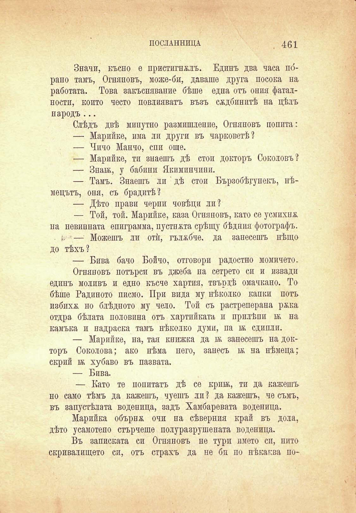

ИОСЛАННИЦА

461

Значи, късно е пристигнатъ. Едпнъ два часа по́рано тамъ, Огняновъ, може-би, даваше друга посока па работата. Това закъсняване бѣше една отъ ония фаталности, който често повлияватъ възъ сждбинптѣ на цѣлъ народъ ...

Слѣдъ двѣ минутно размишление, Огняновъ попита:

— Марийке, има ли други въ чарковетѣ?

— Чичо Манно, спи още.

— Марийке, ти знаешъ дѣ стоп докторъ Соколовъ?

— Знай;, у бабини Якиминчини.

— Тамъ. Знаешъ ли ' дѣ стои Бързобѣгунекъ, нѣмецътъ, оня, съ брадитѣ?

— Дѣто прави черпи човѣци ли?

— Той, той. Марийке, каза Огняновъ, като се усмихна, па невинната епиграмма, пустнжта срѣщу бѣдния фотографъ.

• (■ — Можешъ ли отѝ, гълѫбче, да занесешъ нѣщо до тѣхъ?

— Бива бачо Бойчо, отговори радостно момичето.

Огняновъ потърси въ джеба на сетрето си и извади единъ моливъ и едно късче хартия, твърдѣ омачкано. То бѣше Радиното писмо. При вида му нѣколко капки поть избихѫ но блѣдпото му чело. Той съ растреперапа ржка отдра бѣлата половина отъ хартии ката и прилѣпи ж на камъка и надраска тамъ нѣколко думи, па й; сдипли.

— Марийке, на, тая книжка да бк занесешъ на докторъ Соколова; ако нѣма него, занесъ й; на нѣмеца; скрий бк хубаво въ пазвата.

— Бива.

— Като те попитатъ дѣ се крий;, ти да кажешъ но само тѣмъ да кажешъ, чуешъ ли ? да кажешъ, че съмъ, въ запустѣлата воденица, задъ Хамбаревата воденица.

Марийка обърнж очи на сѣвернпя край въ дола, дѣто усамотено стърчеше полуразрушената воденица.

Въ записката си Огняновъ не тури името си, пито скривалището си, отъ страхъ да не би по нѣкаква по*

