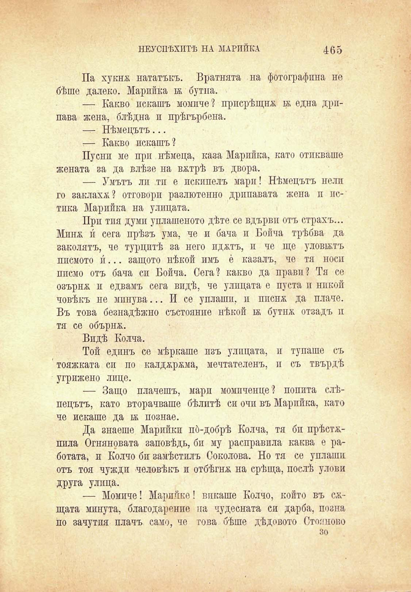

НЕУСПѢХИТѢ НА МАРИЙКА	435

Па хукнж нататъкъ. Вратнята на фотографина не бѣше далеко. Марийка 1Ж бутна.

— Какво искашъ момиче? присрѣщнж бк една дрипава жена, блѣдна и прѣгърбена.

— Нѣмецътъ...

— Какво искашъ?

Пусни ме при нѣмеца, каза Марийка, като отпиваше жената за да влѣзе на вжтрѣ въ двора.

— Умътъ ли тп е пекинецъ мари! Нѣмецътъ нелп го заклахѫ? отговори разлютенно дрипавата жена и истика Марийка на улицата.

При тия думи уплашеното дѣте се вдърви отъ страхъ... Минж и сега прѣзъ ума, че и бача и Бойча трѣбва да заколятъ, че турцитѣ за него иджтъ, и че ще уловътъ писмото и́... защото нѣкой имъ е́ казалъ, че тя носи ппсмо отъ бача си Бойча. Сега? какво да прави? Тя се озърнж и едвамъ сега впдѣ, че улицата е пуста и никой човѣкъ не мпнува... И се уплаши, и ппснж да плаче. Въ това безнадѣжно състоянпе нѣкой и бутнж отзадъ п тя се обърнж.

Впдѣ Колча.

Той единъ се мѣркаше изъ улицата, и тупаше съ тояжката си по калджржма, мечтателенъ, и съ твърдѣ угрижено лице.

— Защо плачешъ, мари момиченце? попита слѣпецътъ, като вторачваше бѣлитѣ си очи въ Марийка, като че искаше да 1ж познае.

Да знаеше Марийкп по́-добрѣ Колча, тя бп прѣстжпила Огняновата заповѣдь, би му расправила каква е работата, и Колчо би замѣстилъ Соколова. Но тя се уплаши отъ тоя чужди человѣкъ и отбѣгнж на срѣща, послѣ улови друга улица.

— Момиче! Марийке! викаше Колчо, който въ сжщата минута, благодарение па чудесната си дарба, позна по зачутпя плачъ само, че това бѣше дѣдовото Стоя ново зо

