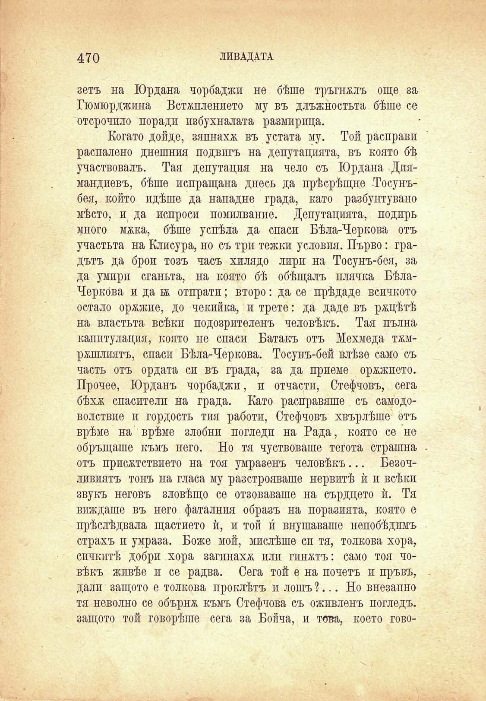

470

ЛИВАДАТА

зетъ на Юрдана чорбаджи не бѣше тръгнжлъ още за Гюмюрджина Встѫплението му въ длъжностьта бѣше се отсрочило поради избухвалата размирица.

Когато дойде, зяпнахѫ въ устата му. Той расправп распалено днешния подвигъ на депутацията, въ която бѣ участвовалъ. Тая депутация на чело съ Юрдана Диамандиевъ, бѣше непращана днесъ да прѣсрѣщне Тосунъбея, който идѣше да нападне града, като разбунтувано мѣсто, и да испроси помилвание. Депутацията, подиръ много мяка, бѣше успѣла да спаси Бѣла-Черкова отъ участьта на Клисура, но съ три тежки условия. Първо: градътъ да брои тозъ часъ хилядо лири на Тосунъ-бея, за да умири сганьта, на която бѣ обѣщалъ плячка БѣлаЧеркОва и да б& отпрати; второ: да се прѣдаде всичкото остало орѫжие, до чекийка, и трете: да даде въ ржцѣтѣ на властьта всѣки подозрителенъ человѣкъ. Тая пълна капитулация, която не спаси Батакъ отъ Мехмеда тжмржшлиятъ, спаси Бѣла-Черкова. Тосунъ-бей влѣзе само съ часть отъ ордата си въ града, за да приеме орѫжието. Прочее, Юрданъ чорбаджи, и отчасти, Стефчовъ, сега бѣхѫ спасители на града. Като расправяше съ самодоволствие и гордость тия работи, Стефчовъ хвърлѣше отъ врѣме на врѣме злобни погледи на Рада, която се не обръщаше къмъ него. Но тя чуствоваше тегота страшна отъ присжтствието на тоя умразенъ человѣкъ... Безочливиятъ тонъ на гласа му разстройваше нервитѣ ѝ и всѣки звукъ неговъ зловѣщо се отзоваваше на сърдцето ѝ. Тя виждаше въ него фаталния образъ на поразията, която е прѣслѣдвала щастието ѝ, и той и́ внушаваше непобѣдимъ страхъ и умраза. Боже мой, мислѣше си тя, толкова хора, синкитѣ добри хора загинаха или гинжтъ: само тоя човѣкъ живѣе и се радва. Сега той е на почеть и пръвъ, дали защото е толкова проклѣтъ и лошъ ?... Но внезапно тя неволно се обърнж къмъ Стефчова съ ожпвленъ погледъ, защото той говорѣше сега за Бойча, и това, което гово

