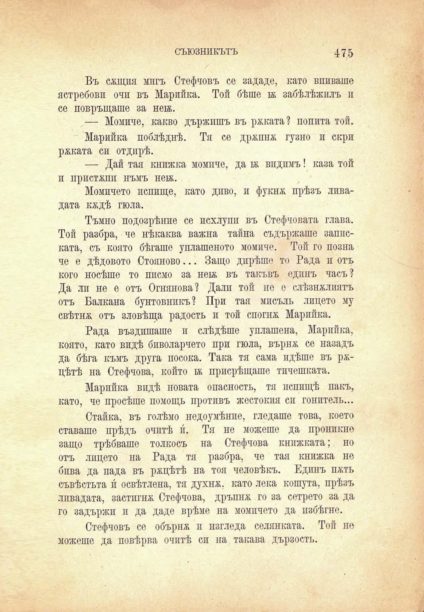

съюзникътъ

475

Въ сжщпя мигъ Стефчовъ се зададе, като впиваше ястребови очи въ Марийка. Той бѣше ьк забѣлѣжилъ п се повръщаше за нета.

— Момиче, какво държишъ въ ржката? попита той.

Марийка поблѣднѣ. Тя се држпнж гузно и скри ржката си отдирѣ.

— Дай тая книжка момпче, да 1ж впдпмъ! каза той п пристжпп нъмъ нек.

Момичето петице, като диво, и фукнж прѣзъ ливадата кждѣ гюла.

Тъмно подозрѣние се похлупи въ Стефчовата глава. Той разбра, че нѣкаква важна тайна съдържаше записката, съ която бѣгаше уплашеното момиче. Той го позна че е дѣдовото Стояново... Защо дирѣше то Рада и отъ кого носѣше то писмо за не1ж въ такъвъ едпнъ часъ? Да ли не е отъ Огнянова? Дали той но е слѣзнжлиятъ отъ Балкана бунтовникъ? При тая мисъль лицето му свѣтнж отъ зловѣща радость и той спогнж Марийка.

Рада въздишаше и слѣдѣше уплашена, Марийка, която, като видѣ биволарчето при гюла, върнж се назадъ да бѣга къмъ друга посока. Така тя сама идѣше въ ржцѣтѣ на Стефчова, който 1ж присрѣщаше тичешката.

Марийка видѣ новата опасность, тя пспищѣ пакъ, като, че просѣше помощь противъ жестокия си гонитель...

Стайка, въ голѣмо недоумѣнпе, гледаше това, което ставаше прѣдъ очптѣ и. Тя не можеше да проникне защо трѣбваше толкосъ на Стефчова книжната; но отъ лицето на Рада тя разбра, че тая книжка не бива да пада въ ржцѣтѣ на тоя человѣкъ. Едипъ пжть съвѣстьта и́ освѣтлена, тя духнж, като лека кошута, прѣзъ ливадата, застигнж Стефчова, дръпнж го за сетрето за да го задържи и да даде врѣме на момичето да избѣгне.

Стефчовъ се обърнж и изгледа селянката. Той но можеше да повѣрва очптѣ си на такава дързость.

