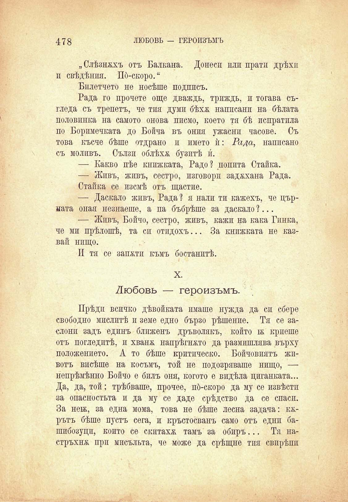

478

ЛЮБОВЬ — ГЕРОИЗЪМЪ

„ Слѣзнжхъ отъ Балкана. Донеси или прати дрѣхи и свѣдѣния. Пб-скоро.“

Билетчето не носѣше подписъ.

Рада го прочете още дважди, триждь, и тогава съгледа съ трепетъ, че тия думи бѣхя напивани на бѣлата половинка на самото онова писмо, което тя бѣ испратпла по Боримечката до Бойча въ ония ужасни часове. Съ това късче бѣше отдрано и името ѝ: Рада, наппсано съ моливъ. Сълзи облѣха бузитѣ и́.

— Какво пѣе книжката, Радо? попита Стайка.

— Живъ, живъ, сестро, изговори задухана Рада.

Стайка се изсмѣ отъ щастие.

— Даскало живъ, Рада? я нали ти кажехъ, че църната оная познаеше, а па бъбрѣше за даскало ?...

— Живъ, Бойчо, сестро, живъ, кажи на кака Гинка, че ми прѣлошѣ, та си отидохъ... За книжката не казвай нищо.

И тя се запоти къмъ бостанитѣ.

X.

Любовь — героизъмъ.

Прѣди всичко дѣвойката имаше нужда да си сбере свободно мислитѣ и земе едно бързо рѣшение. Тя се заслони задъ единъ ближенъ дръволякъ, който к криеше отъ погледитѣ, и хваня напрѣгнжто да размишлява върху положението. А то бѣше критическо. Бойчовиятъ жпвотъ висѣше на косъмъ, той не подозряваше нищо, — непрѣмѣнно Бойчо е билъ оня, когото е видѣла циганката... Да, да, той; трѣбваше, прочее, по́-скоро да му се извѣстп за опасностьта и да му се даде срѣдство да се спаси. За нета, за една мома, това не бѣше лесна задача: кирътъ бѣше пустъ сега, и кръстосванъ само отъ едни башибозуци, който се скитаха тамъ за обиръ... Тя настръхна при мисъльта, че може да срѣщне тия свпрѣпп

