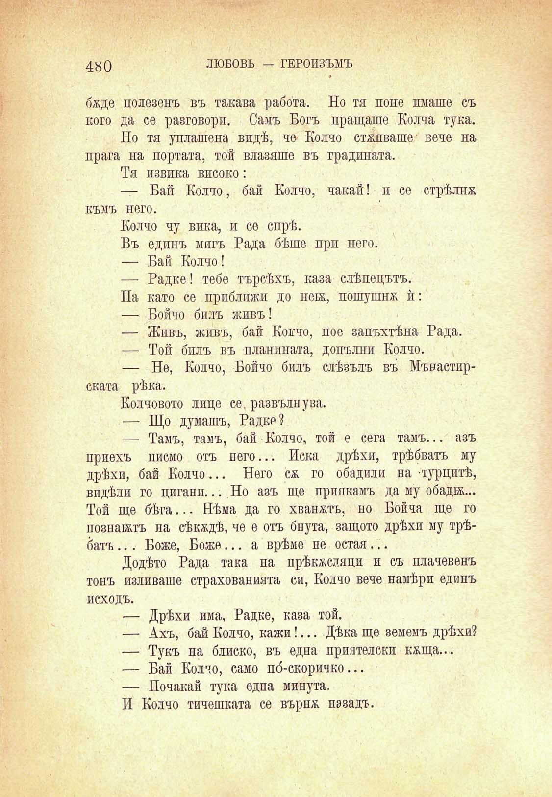



4^0	ЛЮБОВЬ — ГЕРОИЗЪМЪ

бѫде полезенъ въ такава работа. Но тя поне имаше съ кого да се разговори. Самъ Богъ пращаше Колча тука.

Но тя уплашена видѣ, че Колчо степваше вече на прага иа портата, той влазяше въ градината.

Тя извика високо:

— Бай Колчо, бай Колчо, чакай! и се стрѣлнж къмъ него.

Колчо чу вика, и се спрѣ.

Въ единъ мигъ Рада бѣше при него.

— Бай Колчо!

— Радке! тебе търсѣхъ, каза слѣпецътъ.

Па като се приближи до ненк, пошушнж ѝ:

— Бойчо билъ живъ!

— Живъ, живъ, бай Колчо, пое запъхтѣна Рада.

— Той билъ въ планината, допълни Колчо.

— Не, Колчо, Бойчо билъ слѣзълъ въ Мънастирската рѣка.

Колчовото лице се. развълнува.

— Що думашъ, Радке?

— Тамъ, тамъ, бай Колчо, той е сега тамъ... азъ приехъ писмо отъ него... Иска дрѣхи, трѣбватъ му дрѣхи, бай Колчо... Него сѫ го обадили на турцитѣ, видѣли го цигани... Но азъ ще припкамъ да му обадж... Той ще бѣга... Нѣма да го хванжлъ, но Бойча ще го познаятъ на сѣкждѣ, че е отъ бнута, защото дрѣхи му трѣбатъ... Боже, Боже... а врѣме не остая...

Додѣто Рада така на прѣкжсляци и съ плачевенъ тонъ изливаше страхованията си, Колчо вече намѣри единъ исходъ.

— Дрѣхи има, Радке, каза той.

— Ахъ, бай Колчо, кажи!... Дѣка ще земемъ дрѣхи?

— Тукъ на блиско, въ една приятелски кжща...

— Бай Колчо, само по́-скоричко...

— Почакай тука една минута.

И Колчо тичешката се върнж назадъ.

