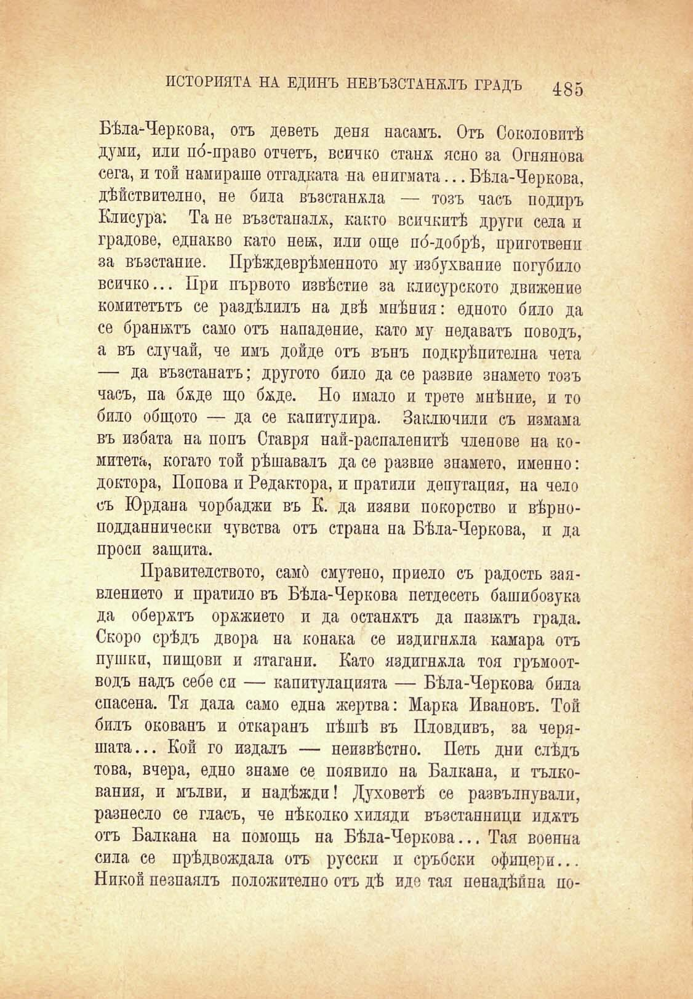

ИСТОРИЯТА НА ЕДИНЪ НЕВЪЗСТАНОЪ ГРАДЪ 435

Бѣла-Черкова, отъ деветь деня насамъ. Отъ Соколовитѣ думи, или по́-право отчетъ, всичко станж ясно за Огнянова сега, и той намираше отгадката на енигмата... Бѣла-Черкова. дѣйствително, не била възставала — тозъ часъ подиръ Клисура: Та не възстаналж, както всичкитѣ други села и градове, еднакво като нв!Ж, или още по́-добрѣ, приготвенн за възстание. Прѣждеврѣменното му избухвапие погубило всичко... При първото извѣстие за клисурското движение комитетътъ се раздѣлилъ на двѣ мпѣния: едното било да се бранятъ само отъ нападение, като му недаватъ поводъ, а въ случай, че имъ дойде отъ вънъ подкрѣпителна чета — да възстанатъ; другото било да се развие знамето тозъ часъ, па бѫде що бѫде. Но имало и трето мнѣние, и то било общото — да се капитулира. Заключили съ измама въ избата на попъ Ставря най-распаленитѣ членове на комитета, когато той рѣшавалъ да се развие знамето, именно: доктора, Попова и Редактора, и пратили депутация, на чело съ Юрдана чорбаджи въ К. да изяви покорство и вѣрноподданнически чувства отъ страна на Бѣла-Черкова, и да проси защита.

Правителството, самб смутено, приело съ радость заявлението и пратило въ Бѣла-Черкова петдесеть башибозука да обержтъ оржжието и да останжтъ да пазьктъ града. Скоро срѣдъ двора на конака се издигнжла камара отъ пушки, пищови и ятагани. Като яздигнжла тоя гръмоотводъ надъ себе си — капитулацията — Бѣла-Черкова била спасена. Тя дала само една жертва: Марка Ивановъ. Той билъ окованъ и откаранъ пѣшѣ въ Пловдивъ, за черяшата... Кой го издалъ — неизвѣстно. Петь дни слѣдъ това, вчера, едно знаме се появило на Балкана, и тълкования, и мълви, и надѣжди! Духоветѣ се развълнували, разнесло се гласъ, че нѣколко хиляди възстанници иджтъ отъ Балкана на помощь на Бѣла-Черкова... Тая военна сила се прѣдвождала отъ русски и сръбски офицери... Никой пезпаялъ положително отъ дѣ иде тая пенадѣпна по-

