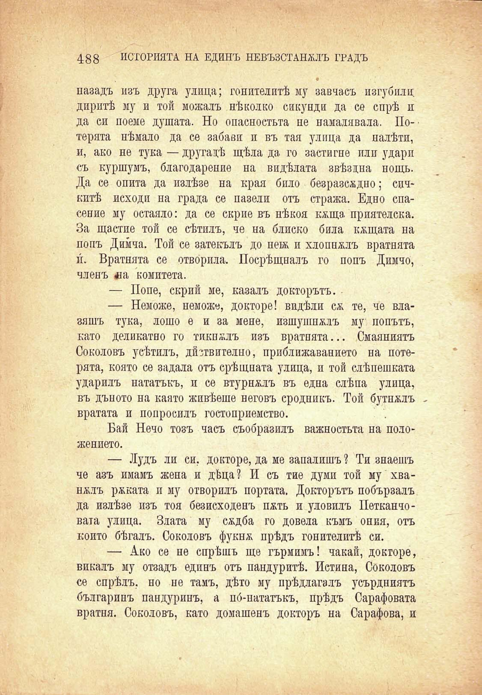

488 ИСТОРИЯТА НА ЕДИНЪ НЕВЪЗСТАНМЪ ГРАДЪ

•

назадъ изъ друга улица; гонителитѣ му завчасъ изгубили диритѣ му и той можалъ нѣколко сикунди да се спрѣ и да си поеме душата. Но опасностьта не намалявала. По-' терята нѣмало да се забави и въ тая улица да налѣти, и, ако не тука — другадѣ щѣла да го застигне или удари съ куршумъ, благодарение на видѣлата звѣздна нощь. Да се опита да излѣзе на края било безразсѫдно; сипкитѣ исходи на града се пазели отъ стража. Едно спасение му остаяло: да се скрие въ нѣкоя кжща. приятелска. За щастие той се сѣтилъ, че на блиско била кѫщата на попъ Димча. Той се затекълъ до цевь и хлопналъ вратнята п. Вратнята се отвбрила. Посрѣщналъ го попъ Димчо, членъ *1а комитета.

— Поне, скрий ме, казалъ докторътъ.

— Неможе, неможе, докторе! видѣли сѫ те, че влазяшъ тука, лошо е и за мене, изшуишждъ му попътъ, като деликатно го тиквалъ изъ вратнята... Смаяниятъ Соколовъ усѣтилъ, дйзтвително, приближаването на потерята, която се задала отъ срѣщната улица, и той слѣпешката ударилъ нататъкъ, и се втурналъ въ една слѣпа улица, въ дъното на каято живѣеше неговъ сродникъ. Той бутналъ вратата и попросилъ гостоприемство.

Бай Нечо тозъ часъ съобразилъ важностьта на положението.

— Лудъ ли си. докторе, да ме запалишъ ? Ти знаешъ че азъ имамъ жена и дѣца? И съ тие думи той му хваналъ ржката и му отворилъ портата. Докторътъ побързалъ да излѣзе изъ тоя безисходенъ пжть и уловилъ Петканчовата улица. Злата му сждба го довела къмъ ония, отъ който бѣгалъ. Соколовъ фукнж прѣдъ гонителитѣ си.

— Ако се не спрѣшъ ще гърмимъ! чакай, докторе, викалъ му отзадъ единъ отъ пандуритѣ. Истина, Соколовъ се спрѣлъ, но не тамъ, дѣто му прѣдлагалъ усърдниятъ българинъ пандуринъ, а по́-пататъкъ, прѣдъ Сарафовата вратня. Соколовъ, като домашенъ докторъ на Сарафова, и

