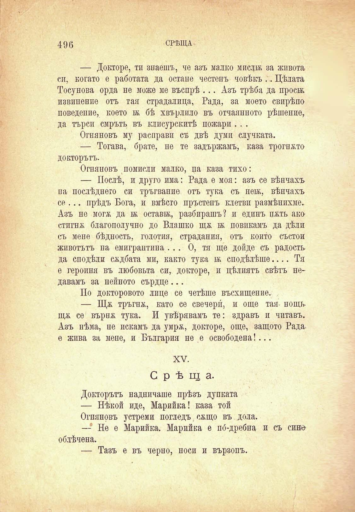

496

СРѢЩА

— Докторе, ти знаешъ, че азъ малко мисли за живота си, когато е работата да остане честенъ човѣкъ ... Цѣлата Тосунова орда не може ме въспрѣ ... Азъ трѣба да проси извинение отъ тая страдалица, Рада, за моето свирѣпо поведение, което и бѣ хвърляло въ отчаянното рѣшение, да търси смръть въ клисурскитѣ пожари . . .

Огняновъ му расправи съ двѣ думи случката.

— Тогава, брате, не те задържамъ, каза трогнато докторътъ.

Огняновъ помисли малко, па каза тихо:

— Послѣ, и друго има: Рада е моя: азъ се вѣнчахъ па послѣ дието си тръгвание отъ тука съ неи, вѣнчахъ се ... прѣдъ Бога, и вмѣсто пръстенъ клетви размѣнихме. Азъ не могя да н остави, разбирашъ? и единъ пять ако стигна благополучно до Влашко щя и повикамъ да дѣли съ мене бѣдность, голотия, страдания, отъ който състои животътъ па емигрантина ... О, тя ще дойде съ радость да сподѣли сядбата ми, както тука и сподѣлѣше.... Тя е героиня въ любовьта си, докторе, и цѣлиятъ свѣтъ подавамъ за нейното сърдце ...

По докторовото лице се четѣше въсхищение.

— Щя тръгна, като се свечери, и още тая- нощь щя се вървя тука. И увѣрявамъ те: здравъ и читавъ. Азъ нѣма, не искамъ да умря, докторе, още, защото Радае жива за мене, и България не е освободена!...

XV.

Срѣща.

Докторътъ надничаше прѣзъ дупката

— Нѣкой иде, Марийка! каза той

Огняновъ устреми погледъ. сящо въ дола.

-- Не е Марийка. Марийка е по́-дребна и съ сипеоблѣчена.

— Тазъ е въ черно, носи и вързопъ.

