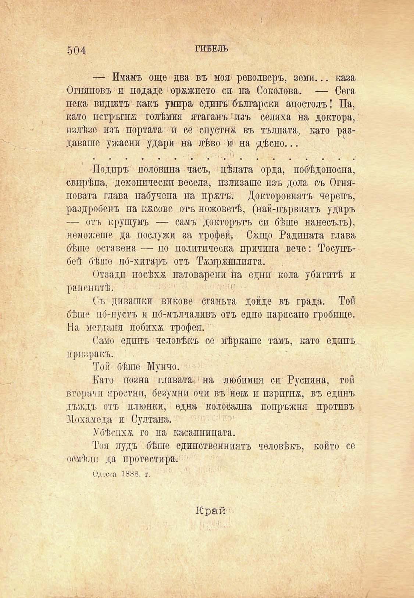

504

ГИБЕЛЬ

— Имамъ още два въ моя револверъ, земи... каза Огняновъ и подаде ' орѫжието си на Соколова. — Сега нека видбктъ какъ умира единъ български апостолъ! Па, като потръгна голѣмия ятаганъ "изъ селяха на доктора, излѣзе изъ портата и се спустнж въ тълпата, като раздаваше ужасни удари на лѣво и на дѣсно...

Подиръ половина часъ, цѣлата орда, побѣдоносна, свирѣпа, демонически весела, излизаше изъ дола съ Огняновата глава набучена на пржтъ. Докторовиятъ черепъ, раздробенъ на косове отъ ножоветѣ, (най-първиятъ ударъ — отъ крушумъ — самъ докторътъ си бѣше нанесълъ), неможеше да послужи за трофей. Сжщо Гадината глава бѣше оставена — по политическа причина вече: Тосунъбей бѣше по́-хитаръ отъ ТжмржШлията.

Отзади носѣха натоварени на едни кола убититѣ и раненитѣ.

Съ дивашки викове сганьта дойде въ града. Той бѣше иб-пустъ и по́-мълчаливъ отъ едно парясано гробище. На мегдана побихѫ трофея.

Само единъ человѣкъ се мѣркаше тамъ, като единъ призракъ.

Той бѣше Мунчо.

Като позна главата на любимия си Русияна, той вторачи яростни, безумни очи въ новъ и изригна, въ единъ дъждъ отъ плюнки, една колосална попръжня противъ Мохамеда и Султана.

Убѣсихѫ го на касапницата.

Тоя лудъ бѣше единственниятъ человѣкъ, който се обмѣни да протестира.

Одеска 1888. г.

Край

